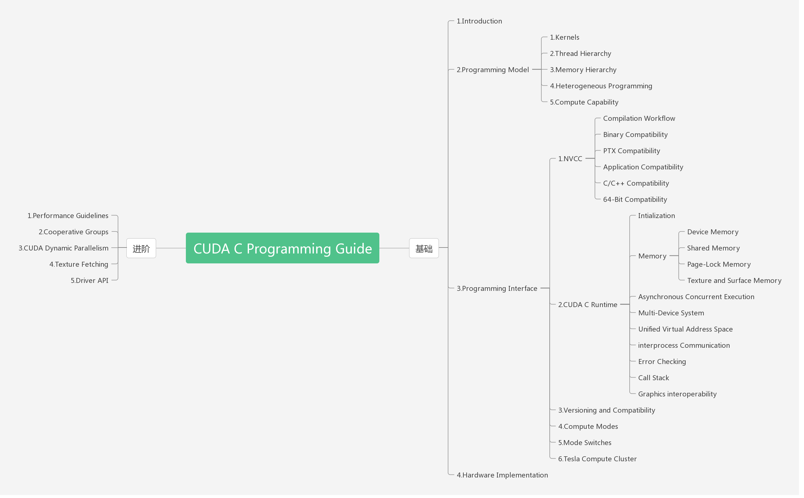
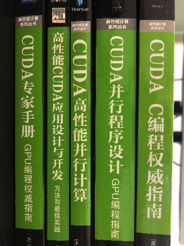

**Abstract:** 本文介绍CUDA编程的入门知识，作为CUDA系列的第一篇文章，介绍整体结构
**Keywords:** CUDA,CUDA introduction

<!--more-->

## 开篇废话
前几天有个朋友搞了个公众号，邀请我来当文章提供者，很欣然，因为一个行业的进步肯定离不开知识的传播和交流，公众号，小文章，这些在目前快节奏的社会变得更吸引人，节约时间，全是干货，所以读书就变得慢，低效，高效的社会带来了高速的经济发展，更多的收入让我们享受了更好的生活。
但是我还听过一句话，电影里面的一句台词，不是名人说的，但我觉得非常值得我思考，“慢就是稳，稳就是快”，矛盾的一句话，可以上升到哲学范畴了。
不管怎么说，只要是知识的传播我都赞成并支持，如果有人想转载我的文章，第一，不要修改我的意思，第二，表明出处，其他的我都表示同意，不用跟我取得联系也可以使用，如果觉得废话这段太长，请删掉。

## CUDA
我们新年第一篇文章用CUDA系列的第一篇开头，之前一直想研究CUDA，记得第一本书是2013年的时候买的，那时候机器学习还是SVM，深度学习还没火，我还在上大学。。当时觉得可以给程序加速那么多，这个技术好棒，所以准备深入学习，于是准备了五年，2018年这次要真的学习一下了。
读这个系列的文章需要以下知识：
1. C/C++ 编程经验，这个不用说，如果C都没学会就要来CUDA，我觉得不理智，根基不稳，也是我一贯所反对的
2. 本系列是Freshman，后面肯定会有Senior和Junior，主要内容肯定有所不同，目前准备的是Freshman 主要介绍基础知识，包括硬件基础，编程模型；Senior主要介绍性能方面的考察，和简单的优化（包括内存等），以及项目实际中的一些技巧；Junior部分主要介绍更高级的性能优化技巧，比如PTX，更高级的内存处理等；优化空间最大的是并行算法的设计，当然不在本系列所讨论的范围内，那是另一个专题了。
3. 本系列主要参考CUDA官方文档以及下面几本书，这几本书我都没全看过，但是我会写点简单的书评以及标明用于哪个阶段

## 学习材料
### 官方文档
主要的学习材料当然用官方的文档做线索（国内某些大家，把别人文档google翻译以后出书，居然还有出版社给出版，是不是很讽刺啊），CUDA的文档很全面，各种方面的基本上都有介绍，入门，安装，编程基础都有，但要求有英文基础，我这个四级的货（其实我已经看论文和英文原文看了两年多了，开始是有点痛苦，不过越看越666）可以很流畅的看懂，所以不要怕，去看吧.
根据入门文档，总结了一下的知识结构图：

看不清可以下载后看，我这里分了两个阶段Freshman和Senior，因为这两个阶段受众人数更多，专业程度低，其中大部分观点在OpenCL里面也能用，但是后面的Junior就会显得更深刻，但是受众人数会降低很多，所以我们先把前面这两个基础系列搞好，再来后面的。
>基础 Freshman
- [Introduction](http://tony4ai.com/2018/01/08/Code-CUDA-1-0-Introduction/)
- Programming Model
  - [kernel](http://tony4ai.com/2018/01/10/Code-CUDA-2-1-Programming-Model-Kernel/)
  - Thread Hierarchy
  - Memory Hierarchy
  - Heterogeneous Programming
  - Compute Capability
- Programming Interface
  - NVCC
    - Compilation Workflow
    - Binary Compatibility
    - PTC Compatibility
    - Application Compatibility
    - C/C++ Compatibility
    - 64-Bit Compatibility
  - CUDA C Runtime
    - Intialization
    - Memory
      - Device Memory
      - Shared Memory
      - Page-Lock Memory
      - Texture and Surface Memory
    - Asynchronous Concurrent Execution
    - Multi-Device System
    - Unified Virtual Address Space
    - Interprocess Communication
    - Error Checking
    - Call Stack
    - Graphics Interoperability
  - Versioning and Compatibility
  - Compute Modes
  - Mode switches
  - Tesla Compute Cluster
- Hardware Implementation

这个就是我们Freshman的学习内容，丰富多彩吧，我们博客的顺序也是上面的顺序。

>进阶 Junior
- Performance Guidelines
- Cooperative Groups
- CUDA Dynamic parallelism
- Texture Fetching
- Driver API

进阶内容暂定如此，可能后面会改变

### 书籍介绍

这几本书有的是刚买的，也有之前（2013年）买的，CUDA到现在已经9个版本了，所以这些书只能用来学习一些不怎么改变的基础，以及最重要的是书中会写一些文档中不会写的编程技巧和经验，所以看书有必要，CUDA系列的书都是机械工业出版社出版的，而且都是这种环保色，纸质非常好，值得拥有
但是书的内容参差不齐，有的是翻译的不怎么样，也有的可能本身写的就不怎么样，我们来挨个介绍下：

#### 《CUDA C编程权威指南》Freshman
基础书籍，与文档介绍内容非常接近可以作为文档学习过程的参考，图和例子比较多，使用CUDA6.0实践

#### 《CUDA 并行程序设计 GPU编程指南》Freshman
这本书也是基础书籍，而且内容应该比上一本的还详细，但是里面翻译的有些晦涩，但是内容很不错，例子代码都很全面，可以和上面一本结合起来一起学习Freshman部分的内容

#### 《CUDA 高性能并行计算》Junior
这本书不是基础书籍，更像Junior部分用的，更强调技术性的优化和实施，基础知识基本没怎么讲，而且更偏向于应用建议Junior部分使用

#### 《高性能CUDA应用程序设计 方案与最佳实践》Junior
这本书从名字就能看出来，就是奔着实践去的，这也是我最早买的那本书，果然入门选错书了

#### 《CUDA 专家手册 GPU编程权威指南》 Junior
看名字更牛，专家手册，专家用的手册，那肯定不是教你怎么写程序的，所以这本书也是面向提高性能的，所以我们会在Junior部分用到

## 总结
之前打算做个小项目来间接的学习CUDA，也就是用到啥学啥，但是想想那样太不专业也会遗漏，我们的“道”是算法和数学，“术”就是编程，这两个都要强，才能在人工智能的领域进行探索和研究，所以我决定回归文档和书籍，系统的学习以后，在把这些技术用于我们的PineNut库的开发，提高自己，服务别人，各位多多支持。
