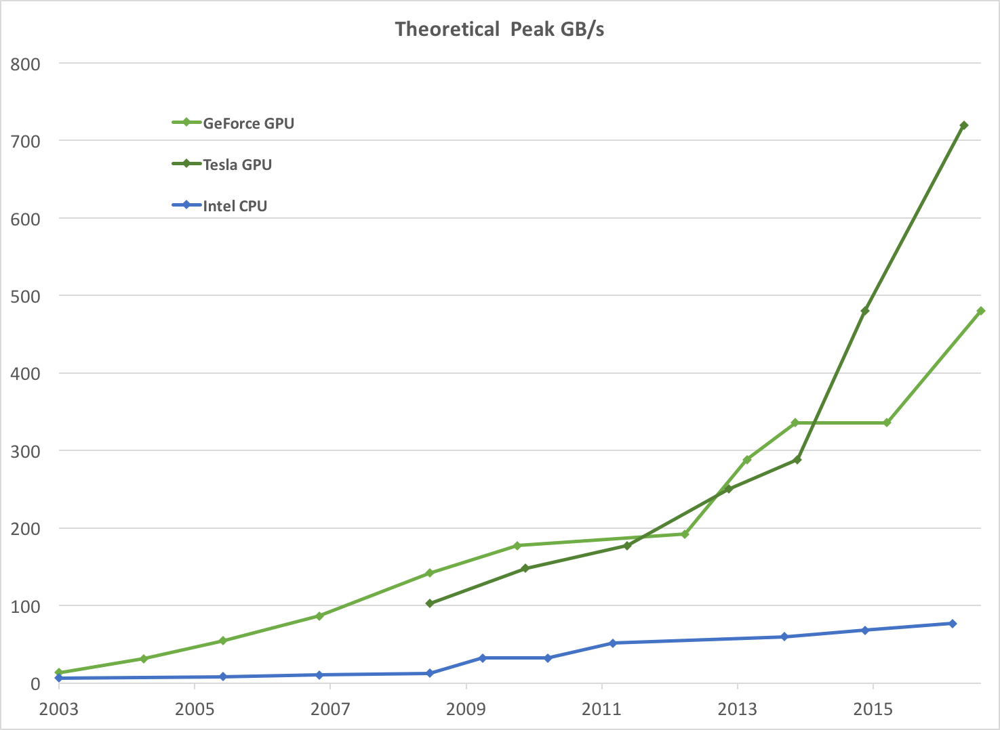
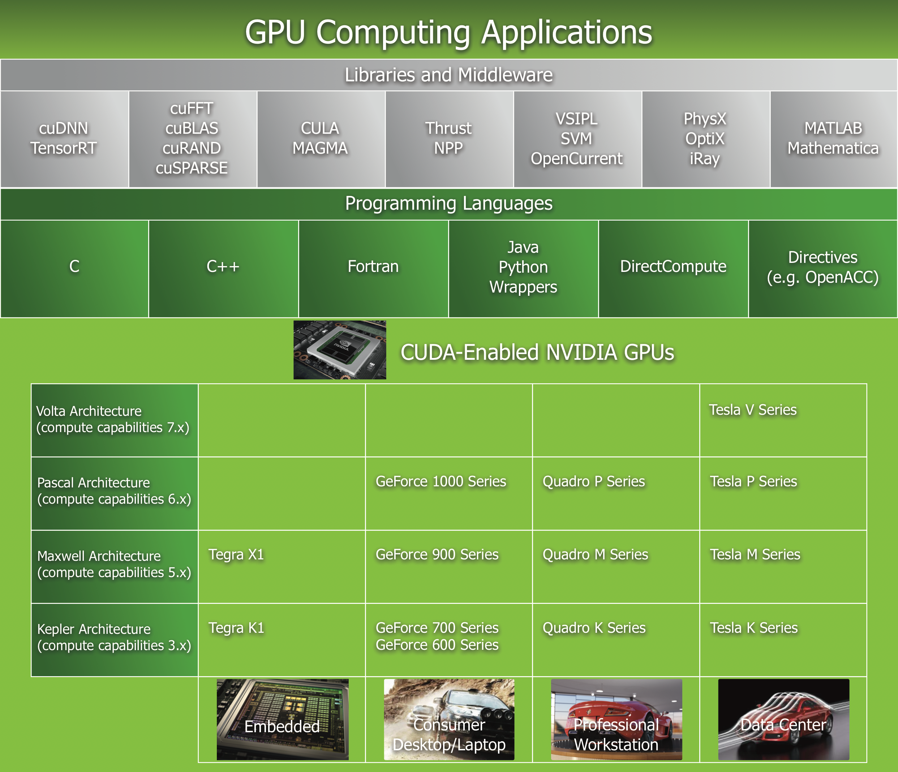

**Abstract:** 本文介绍GPU,CUDA等技术的发展过程，用途以及相关知识
**Keywords:** CUDA Introduction，GPU，Parallel Introduction

<!--more-->
## 开篇废话
今天一篇都是废话

## 事情正在起变化

说本文都是废话其实也不全对，了解一个知识的背景有的时候确实可以帮助理解知识本身，就比如我们都知道深度学习，机器学习，而辅助这些技术的幕后英雄则是大规模的高性能计算集群，换句话说，你带着AlphaGo的代码穿越回大唐，你也玩不转，估计还会当成洋人奸细被抓起来，那有了计算量就有了这些算法么？之前看到过有人讨论，到底是算法的革新带领了业界发展还是计算量的暴增带领了业界的发展，我觉得天天讨论这种问题的人不能说他们思想有问题，只能说确实想不出别的吸引眼球的东西了，各路小编为博大家一笑，使出浑身解数。。
计算量和算法同时促进了行业发展，不是中庸，你这么想想，如果算法没有人去创新，计算机只用来做一些打字工作，386基本上也就够用了，火箭发射都能用386搞定，所以日常生活绝对没问题，1美元能解决生活问题就不需要用一千美元去买最新的Macintosh了，或者倒过来，你带着最新的OS X的安装盘回唐朝，你说这个能上月球，估计也会被打死，所以硬件和算法都不是一下都牛逼的，只是你不在本行业，然后五年看了一次报道，看到了别人一辈子的研究结果，觉得这些都是一夜加班的结果，社会飞速前进，其实并不是这样。
算法和计算量的相互促进是一步步的，算法现在需要三天的计算，于是计算部门的同事开发新的处理器让他三秒钟完成，然后交付给算法工程师，算法工程师说我靠这么快，那我试试我的其他构想，于是又写了个三天的程序，然后计算部门继续开发，这样循环下去，这个叫生态，贾老板那个叫大跃进生态。

## 这是为什么
为什么是GPU，GPU之前是不可编程的，或者说不对用户开放的，人家本来是做图形计算控制显示器的，但图形显示有个很重要的特点就是计算量及其大，而且并行度极其高，学过图像处理的同志们一般都知道，离得远的像素之间基本没有相互关系，所以并行计算对于图形图像及其有用。虽然对用户不可编程，但是你只要把硬件卖给了我，就由不得你了，然后就有hacker开始想办法给GPU编程，来帮助他们完成规模较大的运算，于是他们研究着色语言或者图形处理原语来和GPU对话，
### CPU vs GPU
其实上面这些事发生的年代CPU正在飞速的发展，那些研究GPU的人可能也是处于好奇或者想探索点什么，但是到了2009年发生了转折，CPU遇到了功耗墙，但GPU开始飞速发展。一般这个地方会提到摩尔定律，但是我总觉得这个定律是摩尔猜出来的，或者就是随口一说，结果各大教材以后都有了摩尔定律。
下图就是每秒钟浮点数计算次数（越大越牛x）

学过微机原理的都应该知道，和计算性能相关的不止单位时间计算次数，还有吞吐量，内存速度限制了数据流的速度，这两个结合才能描述计算能力（如果不太明白可以去查一下）

从图上可以清晰的看出，**对于可并行程序**GPU的计算能力远远碾压CPU，于是对于大规模并行的程序（深度学习，以及大部分的数据处理程序）GPU的性能，性价比，性能功耗比都非常高，这种情况下，CPU完败了。

当然在完全串行的程序上，CPU更厉害，因为从单核角度，CPU的一个核更快,于是我们知道了另一个GPU的特点，就是GPU的核特别多。
绿的都是计算核心，如果想了解更多这里面这些方框都是干什么的，再次推荐《深入理解计算机系统》
CPU，GPU架构简易图

### 并行
并行也不是GPU的专利，CPU双核时代造就开启了，并行就是一个任务分解成多个小任务，这些小任务可以同时执行，但是很多程序员不愿意修改自己的程序到并行方式，为啥？不好改，并行程序调试起来比串行单线程麻烦非常多，而且错误也更多，各种锁绝对会让你大吃一斤，而且那时候CPU单个核的速度还在不停的提升，所以大家都在想，改什么程序，等CPU降价就好了。但是事与愿违，CPU发展遇到了功耗墙，4Ghz左右的时候，性能遇到瓶颈，性能功耗比严重下降，发热巨大，这使得CPU厂家们不得不靠添加内核来扩充计算能力，但是单个核的计算能力提高并不那么明显了，所以，现在的程序员们不得不大规模的使用并行计算。
划重点：当面对数据密集型的程序，单个线程计算非常容易的时候，程序员们渴望更多的核来完成这种计算，然后他们发现GPU是个非常合适的模型，然后他们就琢磨，来吧，我们给CPU外挂个设备来计算吧，反正也不是第一次了，之前浮点数都要靠外挂的计算器完成（很早以前的事了），So GPU异构闪亮登场
### 异构
啥东西叫异构，架构不同，什么叫架构，上面那个图就是。架构的分类有好多种，比如按照指令集分（如果不知道啥叫指令集，去看《深入理解计算机系统》），但采用混合运算器（CPU+GPU,CPU+FPGA,CPU+DSP）这些都叫异构。
异构计算不同于CPU自己算，他们需要一定的协作，思路就是：CPU说，我是老大，然后不同的任务分配给不同人来做，显卡你核多，你去做大型计算，数据我一会儿让内存发给你，网卡你去上别的机器上看看还有闲人没有，有的话也叫来一起干活，硬盘你准备好数据，内存一会儿去找你要，输入设备你们都准备好接受用户信息，显示器你虽然没显卡了，但是现实个Terminal还是没问题的，你去闪闪发光吧。
我们关心的主要是前两步：
1. CPU和GPU之间的数据通信
2. 多主机之间的集群合作。

高性能计算（HPC）一般会采用异构计算，当然也有纯CPU或者其他U的，
HPC不仅是一种计算架构，现在看来，他的硬件系统，软件工具，编程平台以及并行编程范例都是HPC的组成部分。
### CUDA
思路都有了，就缺工具栏，再让人家用什么着色语言，图形编程原语有点恶心了，也不利于设备推广，黄老板说，来吧，开发个工具包给他们用吧，把现在的显卡也都支持上，于是就有了CUDA，一种异构计算平台（CPU+Nvidia GPU），在此平台下使用C语言扩展后的高级语言来编写CUDA程序，当然在CPU端可以扩展出其他语言（峰哥说：“如果从操作系统和编译原理来看，所有编程语言都一样”）
CUDA的应用包括但不局限于：

## 如果粮食太多吃不完该怎么办？
### 可扩展模型
CUDA保证了硬件的兼容性，也就是说你更新你的设备，原来的程序还可以运行，而且一般不需要修改什么，可以享受花钱就能提速的快感，CUDA的具体编程模型我们后面详细介绍，但是这里贴张图，这张图表示当硬件变换的时候程序依然过得很好：

如果粮食太多吃不完该怎么办？写好CUDA程序，不断地买显卡就好了，一万到十万的，黄老板都有货
## 总结
今天主要做个介绍，我们结合时代发展，得出CUDA怎么来的，以及用途什么的，还有并行和异构两个重要概念，下一篇介绍硬件，还是会继续讲解并行和异构方面的知识。
