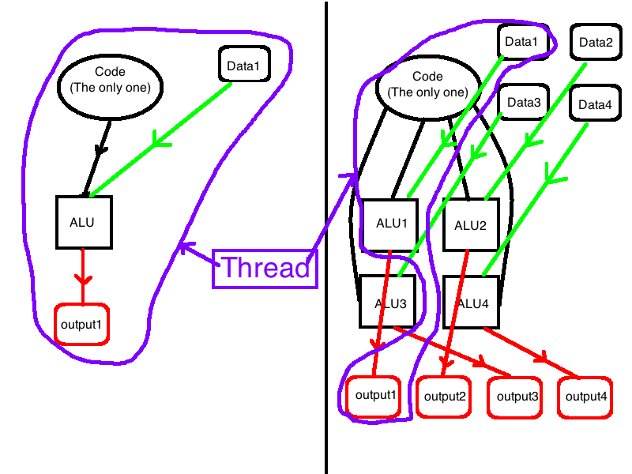

**Abstract:** 本文介绍CUDA编程入门部分，首先介绍Kernel
**Keywords:** CUDA，CUDA Kernel

<!--more-->
## 开篇废话
机器学习的两个分支，算法和实现，这两个其实可以分开，也就是说你可以只研究算法，只做state-of-the-art的方案，具体的实时可以由你的队友，或者其他人完成，至于用多少计算量，也可以不关心，假设有无数计算量的超级电脑，可以随意使用；实现的工作更偏技术，你需要了解机器，懂得算法的计算过程，然后用最少的计算量完成算法，并得到稳定结果。
这两个方向可以选其一，但是我觉得了解实现更能快速方便的验证算法，就像程序员如果了解硬件，那么写出来的软件一般会更快更稳定。

***本文中kernel和GPU核是不同的东西，kernel是指核函数，是代码，GPU核是硬件的半导体***

## CUDA C
CUDA上一篇已经讲过了，他是专门为了使用Nvidia GPU编程的一个工具箱，里面有编程模型，编程工具，程序连接库等一些列工具
CUDA C就是编程语言，用来编写能在GPU上运行的程序的语言，就像C语言入门的Hello World的学习过程一样，但是可能更困难一些。
我们下面就直接贴出可运行代码，然后逐步分析其中的每一部分干了什么，后面的几篇也要借助这个例子：
github:[https://github.com/Tony-Tan/CUDA_Freshman](https://github.com/Tony-Tan/)
```C++
#include <cuda_runtime.h>
#include <stdio.h>
#define ARRAY_SIZE 4
__global__ void VecAdd(int *a ,int *b,int *c)
{
	int i = threadIdx.x;
	c[i]=a[i]+b[i];
}
int main()
{
	int a[]={3,6,9,4};
	int b[]={1,9,3,1};
	int c[ARRAY_SIZE];
	int *a_dev,*b_dev,*c_dev;
//	memory translate
	cudaMalloc((void**)&a_dev,sizeof(int)*ARRAY_SIZE);
	cudaMemcpy(a_dev,a,sizeof(int)*ARRAY_SIZE,cudaMemcpyHostToDevice);
	cudaMalloc((void**)&b_dev,sizeof(int)*ARRAY_SIZE);
	cudaMemcpy(b_dev,b,sizeof(int)*ARRAY_SIZE,cudaMemcpyHostToDevice);
	cudaMalloc((void**)&c_dev,sizeof(int)*ARRAY_SIZE);
//	kernel
	VecAdd<<<1,ARRAY_SIZE>>>(a_dev,b_dev,c_dev);

	cudaMemcpy(c,c_dev,sizeof(int)*ARRAY_SIZE,cudaMemcpyDeviceToHost);

	for(int i=0;i<ARRAY_SIZE;i++)
	{

		printf("%d+%d=%d\n",a[i],b[i],c[i]);
	}
	cudaFree(a_dev);
	cudaFree(b_dev);
	cudaFree(c_dev);
	return 0;
}
```

这个代码可以在GPU上运行，在MAC电脑下，使用Nsight（CDUA内的一个工具）编译运行如下：
1. 新建工程：

2. 选择生成代码版本

3. 选择生成代码运行系统（可以交叉编译）

4. 写代码，然后运行


## Kernel

Kernel是运行在GPU设备上的代码，也就是这部分的二进制代码上下文CPU是没办法使用的，上下文和可执行二进制代码的具体内容可以参考《深入理解操作系统》，我们一般写程序到运行程序的过程是：
> 编辑程序->编译代码->连接库文件->交给CPU执行。

对于CPU和GPU这些过程是一样的（其他硬件编程过程也基本类似，FPGA可能不太一样），只是对应的每一步都不太一样，对于一个CUDA程序，我们要写的不止GPU上的运行代码，还有CPU控制GPU的，也即是说我们在写CUDA的时候实际上是在写两套架构上的运行代码（异构）；

Kernel部分就是运行在GPU上的那部分代码的名称，这些代码编译后在GPU上被执行，而且与CPU上单线程程序不同，这些单线程程序只需要按照其生成的上下文顺序执行即可，而这些kernel被多个计算核心（硬件上的）同时执行不同的版本（代码相同，但数据不同），也就是并行。

进一步解释GPU并行和CPU串行的区别：


注意：***GPU的ALU不同于GPU的核，但且只在上图我们可以简单的把他们当做GPU核***

幼儿园画法重现江湖，串行CPU很好理解，就是ALU执行Code，访问数据，得到结果，然后GPU的ALU1做的事情和CPU一样，ALU2做的code一样但是数据不同，ALU-N code也一样，但是数据不同，这就叫做N个GPU线程。线程是个非常重要的概念，线程的定义可以自己去查一下，我们可以简单的按照上面的插画理解。
## 限定符
C语言中没有的关键字 __global__ 其实还有其他的限定符，用于限定函数的执行方式（CPU还是GPU执行），因为以后我们主要讨论的是GPU异构，所以设备一般指的是GPU，主机指CPU

|     限定符     |     执行     |                     调用                      |           备注           |
|:--------------:|:------------:|:---------------------------------------------:|:------------------------:|
| \_\_global\_\_ | 设备端执行 | 可以从主机调用也可以从计算能力3以上的设备调用 | 必须有一个void的返回类型 |
| \_\_device\_\_ | 设备端执行 |设备端调用||
|  \_\_host\_\_  |  主机端执行  |主机调用|可以省略|


不同的关键字对应不同的函数类型，主要目的是区分函数生成什么架构的可执行文件。

## 调用Kernel

在主机端调用kernel在设备端执行的方式是：
```C++
//	kernel
	VecAdd<<<1,ARRAY_SIZE>>>(a_dev,b_dev,c_dev);
```
这部分代码在上面完整工程中在main函数中，可以看出启动设备的代码在主机端，‘<<<...>>>’是执行配置，配置什么？配置线程的分配，一个GPU核（计算核core）可以接受多个线程，当然接受的多个线程肯定不是同时执行的，因为就一个计算核，这些线程被轮流执行，但是每个核分配多少个线程，用多少个核，这些配置在‘<<<...>>>’，中体现，我们这里使用4个线程，1是什么意思我们在讲线程模型的时候解释
另外一个值得注意的是，与在主机端执行的纯C语言程序不一样，所有CUDA Kernel 的执行都是异步的，不可能所有kernel瞬间同步启动，肯定是轮着来的，CUDA Kernel被CPU调用后，控制权立刻返回给主机也就是，我只通知设备执行，设备反馈说收到通知后，CPU继续执行下文。
## ThreadID

GPU线程可以高达上百万个，如何调度是硬件的事（这个我们需要了解，但是要在后面硬件部分了解），我们需要知道的是如何按照不同的线程处理不同的数据，这部分设定是在kernel里面进行的，也就是我们控制的，为了给每个Thread一个标号，内建变量threadIdx的结构体来表示一个线程，并且这个标号是唯一的，一个号只对应一个thread。

```
int i = threadIdx.x;
c[i]=a[i]+b[i];
```
因为我们配置的时候按照一维线程分布的，所以只需要等于threadIdx.x就可以了，这个地方的细节在后面线程分层部分详细介绍，这里我们可以忽略，然后不同的Id对应不同的数据 a[i]，这样如果这些线程同时在不同的GPU核上执行，就是GPU并行的模型。

## Kernel的限制

1. 只能访问设备内存
2. 必须有void返回类型
3. 不支持可变数量的参数
4. 不支持静态变量
5. 显示异步行为

这个可能因为CUDA版本的升级有所改动，
说明：***这里写的限制是CUDA 5.0版本，现在已经是9.0了还没注意到文档中相关说明，如果有将会修改上述内容***

## 总结
我们本文先对kernel有个大致的了解，简单的可运行程序将带领我们逐步进入整个系统体系，待续。。
