**Abstract:** 早起学习git时候的总结，应该与众不同，大家可以随意看看
**Keywords:** git , Github
<!--more-->
## 开篇废话
开篇废话又回来了，离开博客算是有一年了，之间曾经痛下很多次决心，继续写博客，后来都失败了，前年为了申请个CSDN专家，每天发博客，那个高产的状态，现在已然不行了，时过境迁，当时为了吃口饱饭拼命的武装自己，现在能吃饱了，动力也就没那么强了，还有一个原因是，自己做事情喜欢一气呵成，现在想想，没啥必要，有时候过于追求速度反而虎头蛇尾，莫不如慢慢来，一周一篇的速度坚持下来也是很不错的，好习惯要坚持，Jobs说你只能看到过去，但看不见将来。当站在未来某个时间点t，也许我会非常感激我写下的这篇文字和构思这篇文字的过程。 本文阅读顺序： 对于有Git经验的人： -1，0，1，2，3，4 对于0基础的人： 0，1，2，3，4，-1，1，2，3，4 本文的目的是学会使用Git，对于不正确，不严谨的地方，请留言，对于想通过本文获取知识点考试的同学，可能要小心一些，本文以大白话为主（好像没有考试考这东西吧。。。）

## Git的知识结构

### Git结构图解

废话结束，怎么出来个-1的目录，额，python好像支持这样的索引（但回到的是末尾元素），哈哈，因为我后面标号都写好了，所以懒得改，递减一个知道先后顺序就好，没有任何基础的可以略过这部分，这是本文主要的写作思路和知识结构，可以当做总结，或者提纲来看。
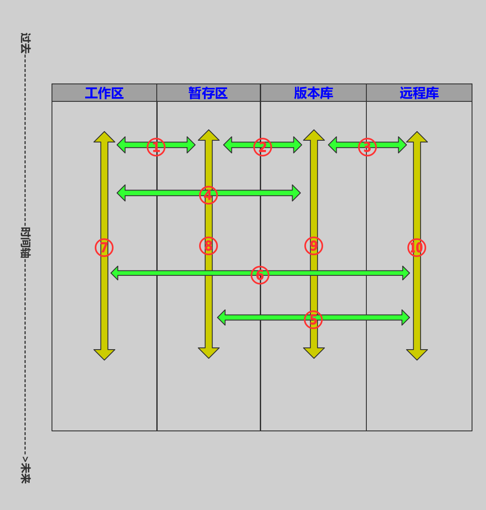


四个区：
1：工作区（本地，可见）
2：暂存区（本地，隐藏）
3：本地库（本地，隐藏）
4：远程库（远程，不可见）
主要操作：
1：工作区和暂存区之间的数据交换
2：暂存区和本地版本库之间的数据交换
3：本地版本库和远程版本库之间的数据交换
4：工作区和本地版本库之间的数据交换
5：暂存区和远程版本库的数据交换
6：工作区和远程版本库的数据交换
7：工作区随时间的变化
8：暂存区随时间的变化
9：本地版本库随时间的变化
10：远程版本库随时间的变化</code>

## Git的起源

### Git是啥

做过毕业设计的都有这种感受：
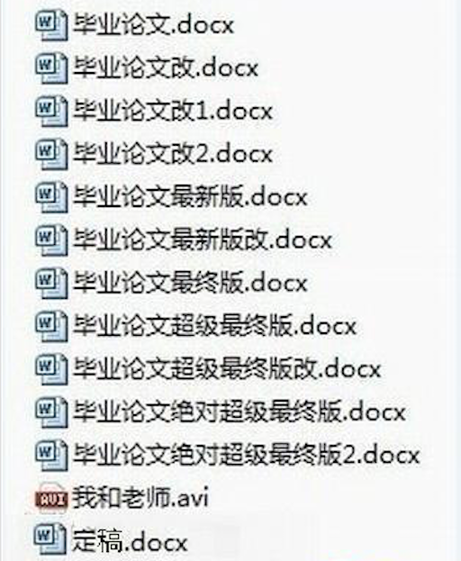


没错，Git能解决这个问题，也解决不了这个问题，能解决这个问题是如果你写代码或者其他文本的话，Git是可以记录下你之前随时存档时的版本快照，以便随时快速恢复到以前的状态，解决不了这个问题是，word的文件不行（问我为啥？问大微软去吧。。。）。 还有一个例子是单机游戏一般都会有的一个读档存档功能，当你要开一个boss的时候为了防止失败以后要从新来过，可以在开打之前存一下档，以便失败后不至于从头再来。 Git是一款快源的软件，能够帮你管理你文件的版本，多人共同开发等，说来说去就是作为一个程序员，如果不会用版本控制工具，将会被人鄙视，不管你写了多少年，也就算个入门，说相声四门功课（好吧，作者喜欢一遍听相声一边干活——）说学逗唱，我觉得程序员的四门功课：操作系统，编译原理，算法数据结构，软件工程。四门功课都做好了，不会是一个烂程序员，有人可能要问，为啥不提编程语言，“如果你站在操作系统和编译原理的角度看编程语言，其实都是一样的”（我目前认识的最牛的一个工程师跟我说的，一个老华为），而版本控制是软件工程中的重要一环。

### Git能干啥

Git能干啥，存档呗，就是你每次提交一次，Git就咔嚓一下给你的所有文件拍个照，相当于保存一个副本到隐藏的区域，也就是前面图0.1-1中，它帮你隐藏了所有之前的论文版本，只给你看最近修改完成的，也可以瞬间回到之前的任意版本。

### Git怎么来的

下面抄一段Git官网的资料 同生活中的许多伟大事物一样，Git 诞生于一个极富纷争大举创新的年代。
Linux 内核开源项目有着为数众广的参与者。 绝大多数的 Linux 内核维护工作都花在了提交补丁和保存归档的繁琐事务上（1991－2002年间）。 到 2002 年，整个项目组开始启用一个专有的分布式版本控制系统 BitKeeper 来管理和维护代码。
到了 2005 年，开发 BitKeeper 的商业公司同 Linux 内核开源社区的合作关系结束，他们收回了 Linux 内核社区免费使用 BitKeeper 的权力。 这就迫使 Linux 开源社区（特别是 Linux 的缔造者 Linux Torvalds）基于使用 BitKcheper 时的经验教训，开发出自己的版本系统。 他们对新的系统制订了若干目标：
速度
简单的设计
对非线性开发模式的强力支持（允许成千上万个并行开发的分支）
完全分布式
有能力高效管理类似 Linux 内核一样的超大规模项目（速度和数据量）
自诞生于 2005 年以来，Git 日臻成熟完善，在高度易用的同时，仍然保留着初期设定的目标。 它的速度飞快，极其适合管理大项目，有着令人难以置信的非线性分支管理系统
就是Linux他爸爸们，一开始开发Linux用了别人的版本控制工具，然后一群想把地球都开源多人尝试破解别人的商用版本，然后别人急了，要干爸爸们，然后大爸爸急了，大喊一声“劳资自己搞”！然后牛逼哄哄的Git就诞生了，一个不大不小的典故，告诉我们：只要脑袋里有东西也会用工具，一定能做出能用的东西。

### 集中式版本控制

集中式版本控制就是同一个工程只在一台服务器上保存最新版本，当你要开发时要从服务器下载完整的最新版本，当你完成开发时候又要重新上传到服务器，当然，问题就来了，一旦服务器挂了，或者彻底挂了，那就彻底挂了。

### 分布式版本控制

于上面说的集中式的版本控制系统不同，分布式的版本控制在所有开发者手里都有一套完整的代码库，也就是只要下载过的开发者都有一个完整的副本，这样带来的好处就是只要这几个人的电脑不同时坏硬盘，这份工程一般是不会丢的，而坏处就是这个项目将会变得很自由，因为所有人都有完整的工程。

## Git的文件夹

### 创建一个库

如何安装Git这个问题就不介绍了，这个如果搞不定，请放弃本文，因为你目前掌握的东西已经足够跟别人吹牛x了。此外在Linux和Mac os下使用Git比较方便，因为都是类Unix的系统。 此外，请不要在公司项目的文件中学习实验Git，否则一切后果，我不负责。。。。。。。。。。。。。。 首先我们先建立一个空的文件夹：
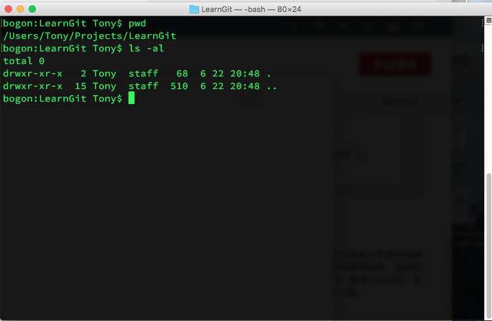

```
bogon:LearnGit Tony$ pwd
/Users/Tony/Projects/LearnGit
bogon:LearnGit Tony$ ls -al
total 0
drwxr-xr-x   2 Tony  staff   68  6 22 20:48 .
drwxr-xr-x  15 Tony  staff  510  6 22 20:48 ..
bogon:LearnGit Tony$
```
新建的文件夹：LearnGit，进入文件夹输入 ```ls -al``` 显示这个文件夹下什么也没有，也没有任何隐藏文件。 下面我们使用Git的 init命令来建立一个版本库：
```
bogon:LearnGit Tony$ git init
Initialized empty Git repository in /Users/Tony/Projects/LearnGit/.git/
```
英译汉：“Initialized empty Git repository in /Users/Tony/Projects/LearnGit/.git/” 初始化一个Git仓库在xxxxx/.git/文件中。 接着我们观察下有没有产生这个.git：
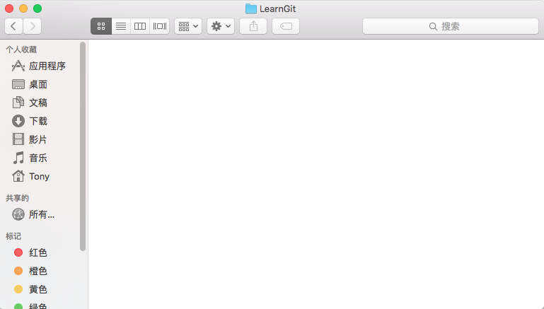
什么都没有，是的，有Linux经验的同学会说，你484傻，.git是个隐藏文件，是的没错，如果我们在命令行下就能看到：
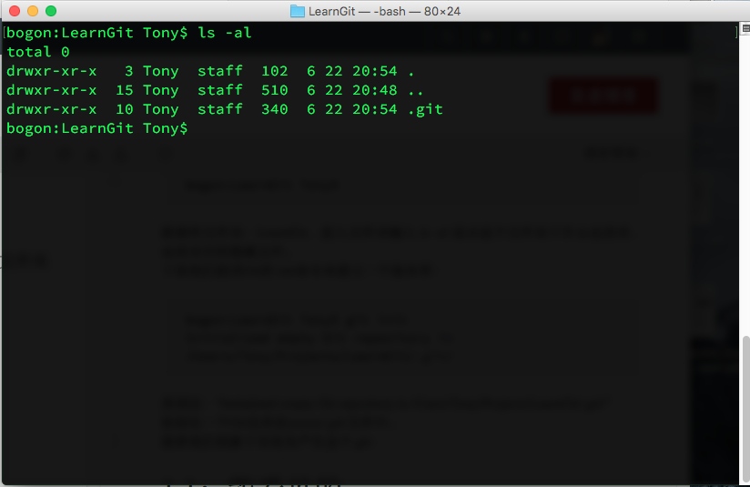
git文件夹已经出现了，其中也有一些其他文件，初级应用一般不涉及，所以也别进去瞎改，有些技术要弄到最底层，但像这种工具，如果只想灵活使用，本人建议别进去改。
从远程clone一份版本库，命令：
```
git clone xxxxxxx.git
```
其中xxxxxx.git是远程版本库的网络地址，我们将clone回来完整的版本库。
### 能看见的

上面我们已经见识到了一些看不见的东西，我们能看到什么呢？新建个文件试试？试试就试试：
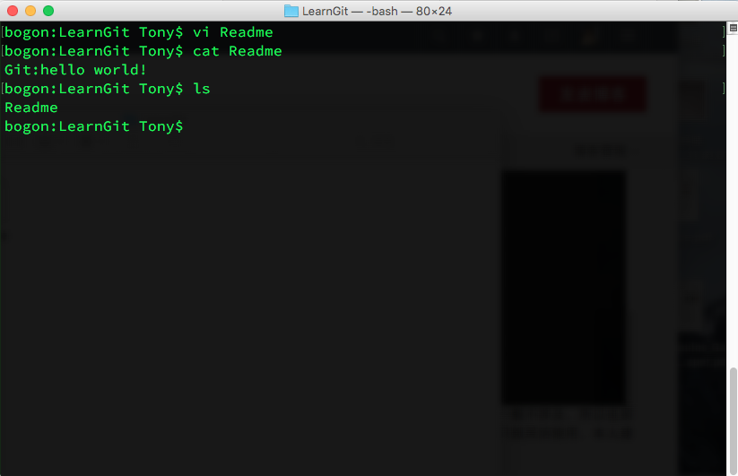
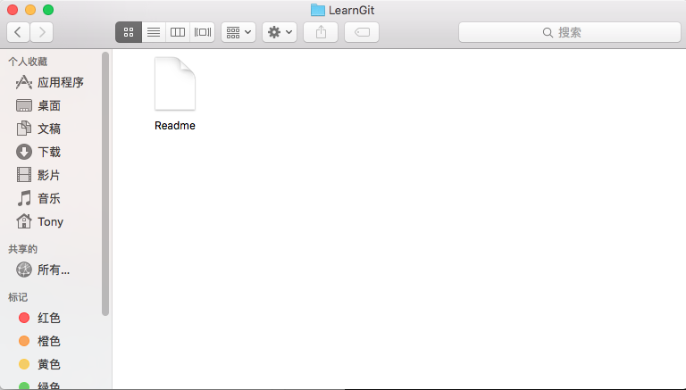
我们新建一个Readme，并输入了Hello world保存，可以看到现在我们的文件夹下有一个文件，而且一切看上去没什么不同。好的，现在我们可以看到一个正常的文件夹，以及正常的文件。我们可以把它当做一张书桌，我们每天趴在这个上面写我们的程序，文档，以及其他的一些资料。

### 看不见的

看不见的在1.0中已经说过了，看不见的在一个隐藏的git文件夹下，而在这个文件夹下可以抽象的看成还有两个部分：一个暂存区，和一个版本库，版本库中保存着一个或者多个分支，而每个分支是过去一系列你存在版本库里面的历史版本。关于分支的详细内容在第4部分详细介绍。可以对照图里的形象描述。

####  本地的
本地版本库就是存在本机中的内容，包括一个版本库的副本（如果进行了修改，那就是被修改到当前状态和从远程拉取回来的版本库的结合）
#### 远程的

听说过Github的同学可能比Git的同学要多，因为很多人都听说过或者去复制过别人的代码，没错Github就是一个大型的Git远程服务器，有人说Github是世界所有软件的基因库，很形象，我们可以把自己的工程发布到Github也可以从Github上clone别人的工程生成一个自己的分支，或者加入别人的项目，Github就是一个典型的远程Git服务站点。

（今天就写到这，下次继续2016年6月22日晚）

## Git的文件状态

继续Git的介绍，文件的状态跟文件所在的位置有关，文件所在的位置就是***第0节***中的那三（四）个区，几个区之间的状态转换就是Git学习最精髓的地方，在这里简单介绍下这几个区的，一个简单的比喻：工作区就是你的书桌，你就在这个书桌上写作业，而且这个书桌附带一个无限大的抽屉，你随时可以把桌子上的作业放入这个抽屉，而且可以无限放进去，但是拿出来的时候一定是***“后进先出”***是的，这个就是工作区的一个简单的比喻，暂存区就是老师的讲桌，交作业的时候你要把作业拿到老师那里，暂时放在讲桌上面，这段时间，你可以取回来（可能老师会不高兴。。哈哈），而当老师把作业拿走的时候，作业可以当做是入库了，就是进入版本库了，更进一步，如果老师把作业交给了学校展出的档案馆（Github）okay，全世界都能看到你的作业了，这个比喻不是很恰当，但是可能会形象一些，直观感受。

### untracked(未跟踪)

所谓未跟踪的文件，就是你刚拿到桌子上，老师不知道那是个啥的文件，你必须给老师看一下，老师才会知道那是个什么，而这一步的操作可以是任何新加文件到当前工作区，比如创建或者复制过来，都可以：
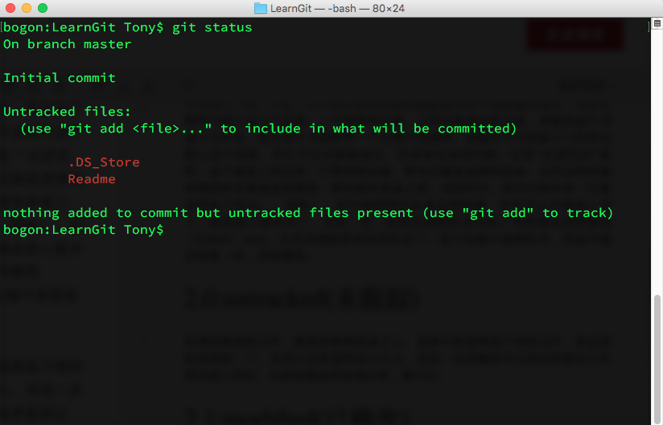
前面我们创建了一个Readme文件，并且未做任何操作，使用status命令可以看出当前工作区文件的修改状态：
```
git status
```
查询当前文件修改，可以看出Readme处于untracked 状态，使用add命令可以使它被版本库跟踪。 .DS_Store是Mac下的一个系统文件，这里我们忽略。

### staged(已暂存)

为了让Git盯上Readme并把它加入版本库，我们使用命令：
```
git add Readme
```
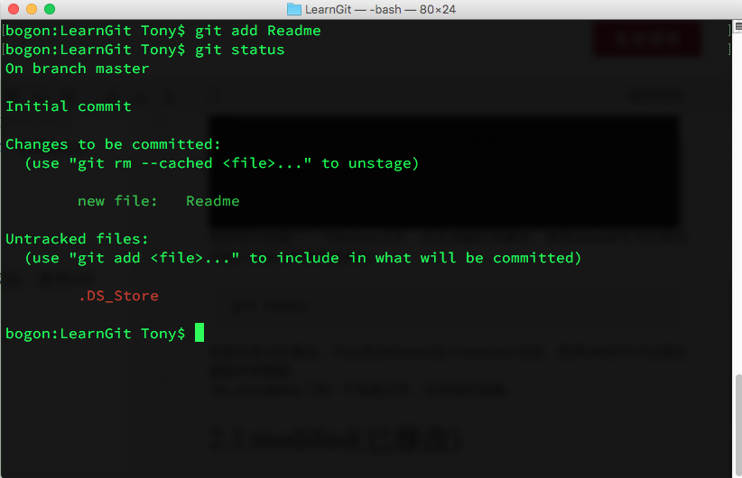
好的现在使用git status可以看到Readme已经被跟踪了，而.DS_Store没有被跟踪，如果使用

```
git add .
```

命令，整个工作区下的所有文件将会被跟踪，这样做的好处是速度快一些，但是可能会把一些不必要的文件加入到版本库中。

### committed(已提交)

将暂存区的修改（文件）送入版本库的命令：

```
git commit -m " xxxxxxx "
```

xxxxxx是本次提交到版本库所修改的简要提醒，这个在当前来看可能是没用的，但是相信我，一个月后你就会完完全全忘记这次修改了什么，为什么修改，所以最好写上一些有意义的简介到里面：
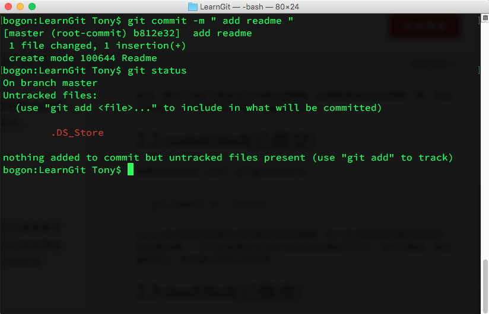
好的这样Readme就入库了，Git将会注意到这个文件的一举一动。

### modified(已修改)

如果对于已经在版本库中的文件比如Readme来说，如果我们作出修改，会怎么样呢？上面说过Git会注意到Readme的一举一动： 我们向Readme加入一句话 Hello Git！</code>
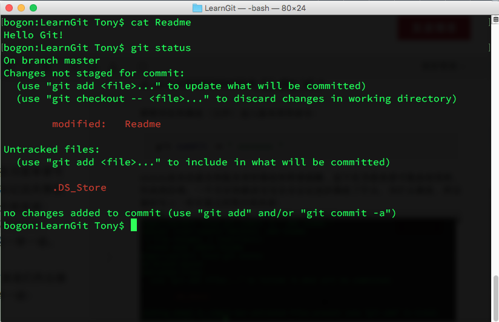
 通过status命令，可以看出，修改后的Readme处于已修改的状态，如果想把新修改的加入版本库，请重复2.1的过程。

### ignore(已忽略)

好吧，我承认，那个未被跟踪的系统文件好讨厌，每次都要提示它未跟踪，像个办法不看他，Git支持忽略一系列文件的的方法，就是它会忽略掉工作区呢.gitignore文件内的所有名字：
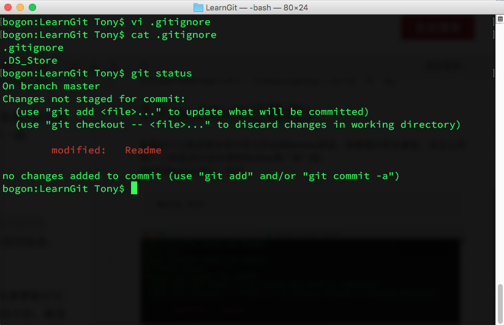
没错，就这么神奇。

### 小结

简单的介绍了下Git的正向文件状态变化：

主要是这张图上①②⑦的从左到右的变化，如果只学会上面这些，可以使用Git最简单的保存功能，后面我们将会讲解③④⑤⑥从左到右，以及从右往左的变化，这样就基本可以使用Git中级功能了，学会分支了以后，就相当于Git的高级功能已经学会了，至于究极功能，请研究手册和源代码，对于工具使用者，学到高级就够了，专业人员请去看源代码，和设计哲学。 （今天就写到这，下次继续2016年6月29日晚）

## Git的分支

### master

### dev(开发)

### debug(修复漏洞)

### zhang3，zhao4，lining，guangkun...

## 总结(2017年9月13日)
为了学习知乎大牛们不停的更新，我也来了个时间戳，git应该算是所有程序员都应该会用的一个工具，这个也是linux下比windows方便的一个案例，多用多练习是这种工具的不二法门，后面有机会还会修改，最近研究数学，还是先把线性代数系列搞定，其间会搬一些以前的博客过来，欢迎大家留言
