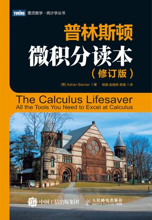

**Abstract:** 《普林斯顿微积分读本》阅读笔记总览
**Keywords:** Calculus Big Picture，The Calculus Lifesaver

<!--more-->
## 开篇废话
微积分之前就已经粗略的学习了一遍了，看了MIT的公开课，也做了他们的课后练习，说句真实感受，微积分这玩意证明相比数学分析差很多，直观性比线性代数差很多，应用性不如概率统计，但是哪哪都有他，论文，文档，看个新闻可能都有微积分；MIT的教授也说，微积分名声不好的主要原因不是微积分知识点难，是因为应用场景，在物理学上，你要分析受力，分析场性质，然后最后一步用微积分求解，换句话说微积分就像一个比较复杂的瑞士军刀，可以干各种事，拿军刀坎木头没问题，但是砍什么木头，需要你有木匠的知识，但是怎么用刀就要看你对刀的理解了，从应用的角度讲一般来说是砍什么木头比较难，但是刀法确实需要练。
练什么？明确的说就是练计算，练化简，练人凑，鬼凑，无敌凑（高中数学老师说的构造一个什么东西出来，其实就是东拼西凑，技巧性非常强，这些东西可以背，可以靠练习，反正基本不靠逻辑）
## 《普林斯顿微积分读本》

这本书全书没有练习，但是全书都是在教大家怎么做题，不是考高分那种，我在线性代数系列前几篇就说了，想看我这些小文章考研复习的同学，我建议您还是去报个班什么的吧，我这些可能会耽误您的宝贵时间。
## Big Picture
看了线性代数系列会注意到Big Picture那一篇有一个知识点的地图，线性代数整体来说地图走法很规范，一级一级下来，但是微积分这个我真是总结不出来，基本上大家互相之间都有关系，如果要画出来就是个全连接的“图”了，那画不画就没啥意思了，所以就用原书的顺序来一章一章的总结，全书章节目录如下：
- 目录
  - 第 1 章　函数、图像和直线
  - 第 2 章　三角学回顾
  - 第 3 章　极限导论
  - 第 4 章　求解多项式的极限问题
  - 第 5 章　连续性和可导性
  - 第 6 章　求解微分问题
  - 第 7 章　三角函数的极限和导数
  - 第 8 章　隐函数求导和相关变化率
  - 第 9 章　指数函数和对数函数
  - 第 10 章　反函数和反三角函数
  - 第 11 章　导数和图像
  - 第 12 章　绘制函数图像
  - 第 13 章　最优化和线性化
  - 第 14 章　洛必达法则及极限问题总结
  - 第 15 章　积分
  - 第 16 章　定积分
  - 第 17 章　微积分基本定理
  - 第 18 章　积分的方法 I
  - 第 19 章　积分的方法 II
  - 第 20 章　反常积分：基本概念
  - 第 21 章　反常积分：如何解题
  - 第 22 章　数列和级数：基本概念
  - 第 23 章　求解级数问题
  - 第 24 章　泰勒多项式、泰勒级数和幂级数导论
  - 第 25 章　求解估算问题
  - 第 26 章　泰勒级数和幂级数：如何解题
  - 第 27 章　参数方程和极坐标
  - 第 28 章　复数
  - 第 29 章　体积、弧长和表面积
  - 第 30 章　微分方程
  - 附录 A　极限及其证明
  - 附录 B　估算积分

## 总结
每章的博客数量不确定，划分可能与原文的没课划分不同，尽量总结出一些比较精华的思想出来，另外希望看我博客的同学回归书本，博客只是辅助，按着书本进度进行才是主线任务。待续。。
