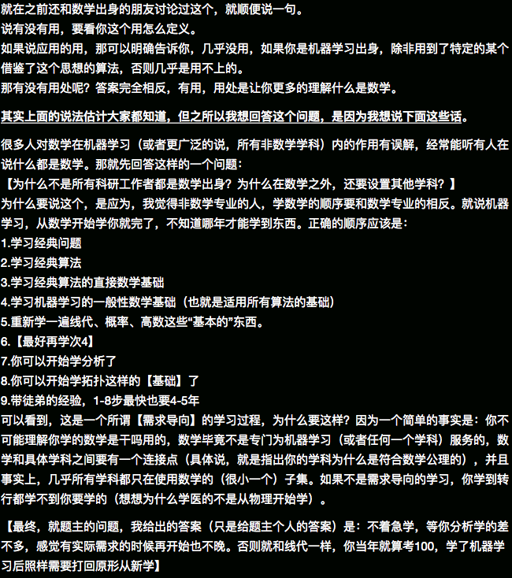

**Abstract:** 通过学习MIT 18.06课程，总结出的线性代数的知识点相互依赖关系，后续博客将会按照相应的依赖关系进行介绍。
**Keywords:** Linear Algebra,Big Picture
<!--more-->

## 开篇废话
废话不多说，网易公开课有MIT 18.06的课程翻译，MIT OCW提供相关练习，如有需要都可以进行下载。
Gilbert Strang教授的讲授能够让大多数人入门，掌握这门课的大部分内容。
本课程教材使用的也是professor Strang的书籍，很遗憾，中国目前好像没有销售。
18.06的最大一个优点就是让你知道，你还不是特别笨，线性代数也没有大学老师讲的那么难。

## 关系图
知识图：

此图由Graphviz生成，相关项目见：
Github：[https://github.com/Tony-Tan/MachineLearningMath](https://github.com/Tony-Tan/MachineLearningMath)

## 总结
线性代数是机器学习的基础数学之一，之前看到知乎上有一段话总结：

基本和我的一些思想不谋而合，很中肯，但是社会浮躁，能安心学习基础的人少之又少。
必须承认的是Professor Strang的讲授是非常有帮助的，如果有幸能见到其本人，我一定会给他鞠个躬，问一句老师好的。
后面线性代数部分的博客基本按照关系图一层一层的啃下去，不会特别长，但是知识点尽量做到环环相扣，欢迎关注。
