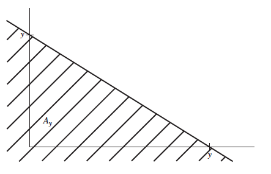

**Abstract:** 本文介绍多随机变量的函数
**Keywords:** 离散多随机变量的函数，连续多随机变量的函数，卷积

<!--more-->
## 开篇废话
任何一个领域的顶级人才都是需要很久的基础知识积累的，所以根据自己的定位可以适当的补充自己的基础知识：
1. 如果你想进入机器学习这个行业，了解基础技术更重要，你需要会使用python，各种工具包，TensorFlow等基础工具
2. 如果你想在机器学习这个行业稳定的输出而不是撞大运式的调参，你需要了解下网络结构，基础算法，并且你需要非常多的经验去调参。
3. 如果你想成为机器学习的研究者，很遗憾的告诉你，你有一大堆数学要学而且真的不是一两年能学完的，所以还没有毕业的铜须有志于进入研究行列的，大家请多学习数学。

以上为个人理解，每一个等级难度都会提升，但是不保证收入和难度完全成正比。

上文书我们讲到单个随机变量的函数变换，本文我们只进行简单变换，因为我们从试验结果到事件进行了一次映射，事件到随机变量又是一次映射，如果从随机变量再到另一个随机变量还是一个映射，这个过程可能都不是一对一的，所以这个过程是对原始信息的总结和提取，提取对我们有用的信息的方法。通过总结归纳出一个或者多个结构化的函数，可以反映信息的容积。
## Random Variables with a Discrete Joint Distribution
>Theorem Functions of Discrete Random Variables. Suppose that $n$ random varibales $X_1,\dots ,X_n$ have a discrete joint distribution for which the joint p.f. is $f$ and that $m$ functions $Y_1,\dots ,Y_m$ of these $n$ random variables are defined as follows:
$$
Y_1=r_1(X_1,\dots,X_n),\\
Y_2=r_2(X_1,\dots,X_n),\\
\vdots\\
Y_m=r_m(X_1,\dots,X_n)
$$
For given values $y_1,\dots,y_m$ fo the $m$ random variables $Y_1,\dots,Y_m$ let $A$ denote the set of all points $(x_1,\dots,x_n)$ such that:
$$
r_1(x_1,\dots,x_n)=y_1\\
r_2(x_1,\dots,x_n)=y_2\\
\vdots\\
r_m(x_1,\dots,x_n)=y_m\\
$$
Then the value of the joint p.f. $g$ of $Y_1,\dots,Y_m$ is specified at the point $(y_1,\dots,y_m)$ by the relation
$$
g(y_1,\dots,y_m)=\sum_{(x_1,\dots,x_n)\in A}f(x_1,\dots,x_n)
$$

和单变量函数的套路基本一致，最后的公式是最关键的逻辑和兴，也就是 $(x_1,\dots,x_n)\in A$ 是解决问题的关键，换句话说，多变量也好，单变量也好，最后我们要做的都是一个逆向的求解，或者叫做穷举的方法，因为我们并没计算公式能够得到全部的向量 $\vec{x}=(x_1,\dots,x_n)$ 保证其满足 $\vec{x}\in A$ 所以$g$ 和 $f$ 的关系也就是这么确定的，找到所有f的输入 $\vec{x}$ 使其满足 $\vec{y_0}$ 的需求，求的所有满足条件的概率和。
这部分和单离散随机变量完全一致，只是随机变量变成了随机变量向量了。

下面的定理关于二项分布和伯努利分布：
>Theorem  Binomial and Bernoulli Distributions. Assume that $X_1,\dots,X_n$ are i.i.d. random variables having the Bernoulli distribution with parameter $p$ .Let $Y=X_1+\dots X_n$ . Then $Y$ has the binomial distribution with parameters $n$ and $p$

当随即向量 $\vec{x}=(x_1,\dots,x_n)$ 是独立同伯努利分布的随机变量的时候，且其概率为 $p$ ，其函数 $Y=f(x_1,\dots,x_n)$ 的分布是二项分布 参数是 $n$ 和 $p$

证明：
1. 可以明确的是，当 $y=x_1+\dots+x_n$ 时，$y$ 的值在 $[0,n]$ 之间
2. 设 $m\in [0,n]$ 那么，根据加法和伯努利分布的性质，其中m个随机变量为1，另外n-m个随机变量为0:  $Pr(Y=m)=\begin{pmatrix}n\\m\end{pmatrix}p^{m}(1-p)^{n-m}$
3. 很显然，Y的分布是二项分布。
4. Q.E.D

## Random Variables with a Continuous Joint Distribution
先来个🌰，不然全文没有例子有点不像概率论学习该有的样子，顺便补充一句，博客只能是总结精华部分，如果想和熟练的掌握，需要去做大量的练习，也就是我们这里的例子也好课后习题也好，反正要练习。
排队的🌰 :
假设队伍里面的前两个客户计划同时离开，$X_i$ 表示第 $i$ 为客户用的时间 $i=1,2$ 假设 $X_1$ 和 $X_2$ 是独立的随机变量，并有相同的分布: $f(x)=2e^{-2x}$ 其中 $x>0$ 因为两个客户想同时离开（也就是先完成的人要等待没完成的人），所以我们感兴趣的是他们用的总时间：$Y=X_1+X_2$ 所以 $Y$ 的p.d.f. 是我们要求的：

$$
\text{for each } y\text{,let }\\
A_y={(x_1,x_2):x_1+x_2\leq y}\\
$$
那么当 $Y\leq y$ 当且仅当 $(X_1,X_2)\in A_y$ 集合 $A_y$ 如图所示

如果我们让 $G(y)$ 来定义 $Y$ 的 c.d.f. 那么对于 $y>0$ 我们有：
$$
G(y)=Pr((X_1,X_2)\in A_y)=\int^{y}_{0}\int^{y-x_2}_{0}4e^{-2x_1-2x_2}dx_1dx_2\\
=\int^{y}_{0}2e^{-2x_2}[1-e^{-2(y-x_2)}]dx_2=\int^{y}_{0}[2e^{-2x_2-2e^{-2y}}]dx_2\\
=1-e^{-2y}-2ye^{-2y}
$$

上面这个例子用到的主要数学技巧是微积分，多元微积分，而得到积分表达式却用到了概率的知识，配合示意图，这个例子变得很清晰，但是其原理还是值得我们研究的。

>Theorem Brute-Force Distribution of a Function.Suppose that the joint p.d.f. of $\vec{X}=(X_1,\dots X_n)$ is $f(\vec{x})$ and that $Y=r(\vec{X})$ For each real number $y$ ,define $A_y=\{x:r(x)\leq y\}$ ,Then the c.d.f. G(y) of Y is:
$$
G(y)=\underbrace{\int\dots \int}_{A_y} f(x)dx
$$

这是个简单暴力的方法来确定一个连续多随机变量分布，和多离散随机变量相似，都是把满足条件的所有的积分（求和）重新得到新变量的 c.d.f ，其证明也很容易：
proof:
$$
G(y)=Pr(Y\leq y)=Pr[r(\vec{X})\leq y]=Pr(\vec{X}\in A_y)
$$

上面的方法适合于变量较少，而且分布比较简单的情况下，当情况复杂了，这种方法将会非常酷男，困得部分也是确定积分范围的部分，也就是说我们基本没什么办法直接得到 $\vec{X}$ 使其满足 $r(\vec{X})\leq y$ ，这个问题将成为一个大问题，如果 $r$ 是可逆的，这个就好办，但是如果r是个多对一的不可逆函数，情况就变得复杂了。
当然我们还是可以研究最简单的情况 —— 线性情况

>Theorem Linear Function of Two Random Varibales Let $X_1$ and $X_2$ have joint p.d.f. $f(x_1,x_2)$ and let $Y=a_1X_1+a_2X_2+b$ with $a_1\neq 0$ The $Y$ has a continuous distribution whose p.d.f. is
$$
g(y)=\int^{\infty}_{-\infty}f(\frac{y-b-a_2x_2}{a_1},x_2)\frac{1}{|a_1|}dx_2
$$

上面的公理给出了线性双连续变量的分布公式，我们来证明一下：
1. 首先我们发现 Y的 c.d.f. G的导数是g，也就是上面定理中的g
2. 对于每一个y，定义 $A_y={(x_1,x_2):a_1x_1+a_2x_2+b\leq y}$
3. $A_y$ 和上面的图（本文就一张图，没错，就是上面例子的那张图） 的情况类似
4. 写出积分限，外部积分到$x_2$ 里层积分是 $x_1$  ,然后就有：
$$
G(y)=\int_{A_y}\int f(x_1,x_2)dx_1dx_2=\int^{\infty}_{-\infty}\int^{\frac{(y-b-a_2x_2)}{a_1}}_{-\infty}f(x_1,x_2)dx_1dx_2
$$
5. 上面内层积分限有点小复杂，因为y是我们关心的变量，放在内层处理起来会麻烦，所以把他挪到外层。方法就是换元, $z=a_1x_1+a_2x_2+b$ ，那么$x_1=\frac{z-a_2x_2-b}{a_1}$ 那么就有 $dx_1=dz_1/a_1$ 于是内层积分就变成了下面这个式子：
$$
\int^{y}_{-\infty}f(\frac{z-b-a_2x_2}{a_1},x_2)\frac{1}{a_1}dz
$$
6. 然后我们使用积分的性质做下面的计算：
$$
G(y)=\int^{\infty}_{-\infty}\int^{y}_{-\infty}f(\frac{z-b-a_2x_2}{a-1}，x_2)\frac{1}{a_1}dzdx_2\\
=\int^{y}_{-\infty}\int^{\infty}_{-\infty}f(\frac{z-b-a_2x_2}{a_1},x_2)dx_2dz
$$

7. 我们可以让内层积分成为一个函数 $t(z)=\int^{\infty}_{-\infty}f(\frac{z-b-a_2x_2}{a_1},x_2)dx_2$ ,然后我们就能得到 $G(y)=\int^{y}_{-\infty}g(z)dz$ 根据微积分基本定理II 其求导等于t(z) ,而 $t{z}$ 就是我们上面定理中的 $g(y)$
8. Q.E.D

精彩的部分在换元，通过换元来得到了我们的目标函数，这个应该算是微积分技巧，跟概率原理没太大关系，但是可以看出，微积分基础是多么重要啊。

然而这个定理你以为就完了？还没有，有更劲爆的还在后面。
当 $\int^{y}_{-\infty}\int^{\infty}_{-\infty}f(\frac{z-b-a_2x_2}{a_1},x_2)dx_2dz$ 中，$a_1=a_2=1$ 并且 $b=0$ 的时候，这个式子改名叫卷积，没错卷积，神经网络来的同学激动不？看了这么久了，终于慢慢的靠上边了。

>Definition Convolution.Let $X_i$ be independent continuous random variables and let $Y=X_1+X_2$ The distribution of $Y$ is called the convolution of the distributions of $X_1$ and $X_2$ .The p.d.f. of $Y$ is sometimes called convolution of the p.d.f.'s of $X_1$ and $X_2$.

如果我们把$X_i$ 的p.d.f. 写成 $f_i$  其中 $i=1,2$ 的话那么 $Y=X_1+X_2$ 的 p.d.f.是：
$$
g(y)=\int^{\infty}_{-\infty}f_1(y-t)f_2(t)dt
$$
其中t是个哑变量，或者叫做临时变量。
同理，交换$X_1$ 和 $X_2$ 能得到：
$$
g(y)=\int^{\infty}_{-\infty}f_1(t)f_2(y-t)dt
$$

怎么样，像卷积了吧，不过不要忘了这是双连续随机变量的线性函数变换后的pd.f.的关系！这句话有点复杂？那就好好多读几遍。
本想举个🌰就结束，结果发现这几个🌰是连续的，所以这里就不再多写了，大家可以参考'Probability and Statistics 4th'中的例子，都非常精彩
## 总结
本文扩展上文介绍了多随机变量的函数，从离散到连续，遵循和单变量类似的法则，但是用处却大大扩展了，下一篇开始就要进入第四章了，我们一起加油。。
