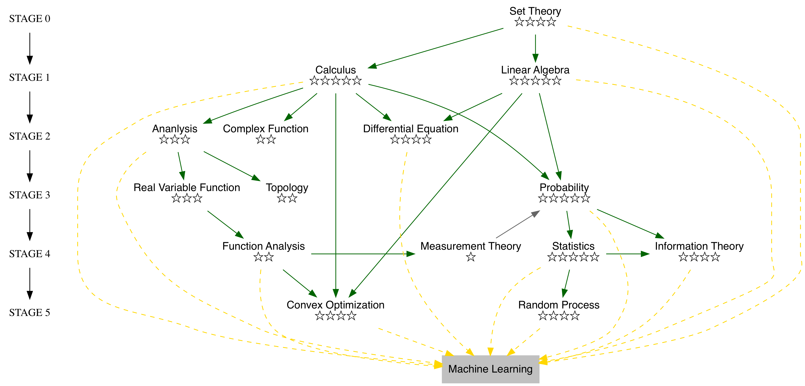
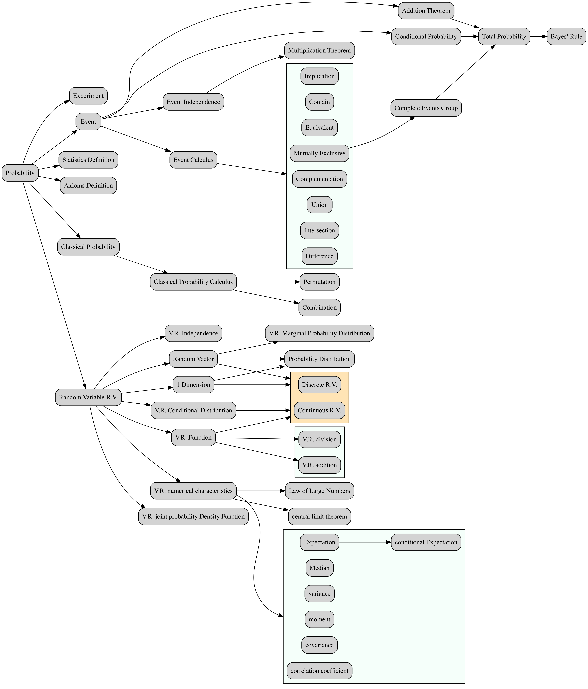

**Abstract:** 关于概率论的整体框架
**Keywords:** 概率论

<!--more-->
## 开篇废话
本篇可能都是废话（没有具体知识点），但是先说点废话中的废话，还是吐槽自己之前上学没有好好学习的吧，说实话，概率论和数理统计基本上学学到的知识等于几个名词，我认为当讲授一门课程的时候，作为讲授者，必须对这套知识背后的理论逻辑，以及实际应用有充分的理解和经验，不然没办法把这套完整的数学分支在几十节课的时间让一群完全没有先验知识的人正确的入门，并走上正确的方向，所以入门传道者一定要非常资深，因为如果你入门就走歪了，后面更麻烦，所以我觉得我很幸运，老子还是一张白纸，哈哈哈。
在一个从应用角度，机器学习用处非常多，有一类用户只负责调用工具或者封装好的算法进行一些既定工作，我们把他们定义为强应用用户，他们不关心算法正确性，速度以及结果，只是按照指定的步骤，使用工具；第二类，弱应用用户，负责找出合适问题的算法，并把使用方式告诉第一类用户，这类用户就需要知识或者经验了，可以没有知识，但要有经验，或者没有经验，只有知识，通过大量的实验找出合适的算法；第三类，进入到算法层，理解算法背后的数学逻辑，以及算法失效的情况，以及速度等底层问题，这类人需要较好的数学基础，因为在阅读论文的时候会有很多基础处理方法，作者会略过，所以掌握好基础很重要。
这三类人没有歧视链，大家都是干工作没有高低贵贱，但是如果你是第一类人但讲的都是第三类的话，而且漏洞百出，这样就贻笑大方了。
## 概率论
概率论不是数理统计，这两个有明显的区别，概率论是已经知道了内部机制，推算结果，数理统计是通过观察结果反推内部机制，机器学习更倾向于后者，但是概率论是数理统计的基础，所以概率论在我们的big big picture里面是五星的，与微积分线性代数同样重要。

与线性代数和微积分不同，微积分更注重计算，也就是当我们有一个算式的时候可以用各种技巧得出最后的答案，这里的微积分是说初级的，高级的到了分析层面就是另一回事了，那个就是探索真理了，线性代数背后有一套完整的理论体系，而且包含了一些可以应用在实际场景的模型，所以线性代数属于基础与实践的边缘部分，故而在工程里显得尤为有用处。
概率论则更加偏向应用，因为其提出就是为了赌博，哈哈，概率论的公式都比较复杂，但是每一个公式背后都有非常明显的事物关系，也就是说概率论中的公式能清楚的反应一些事物的本来面目。
## 教材
我用的陈希孺老先生的书，书中例子非常多，能很清楚的解释公式背后的理论和应用，目前读了前三章关于概率论的部分，决定将概率论和数理统计分开来看，刚又买了一本《Probability and Statistics(Fourth Edition)》(Morris H. DeGroot)据说这本书也很适合入门，美国教材和中国教材以及俄罗斯前苏联的教材风格迥异，感觉美利坚的教材能让你更有自信，苏联教材能让你怀疑人生，而大部分中国教材能让你考上研究生，哈哈，不黑了，辅助教材还有
《初等概率论》 钟开莱
《概率论教程》钟开莱
《概率导论》 Dimitri P. Bertsekas
## 总结
先放个图

这个是根据陈希孺先生的教材总结出的基本框架，概率论相关博客可能会近期开始写作，但是可能没有线性代数更新的那么快，说实话，线性代数学完感觉豁然开朗，但是目前概率还没有很开朗，待到我拨云见日之日就是概率论开播之时。
机器学习相关数学知识可以参考项目,以上图片皆出自此项目：
[https://github.com/Tony-Tan/MachineLearningMath](https://github.com/Tony-Tan/MachineLearningMath)
