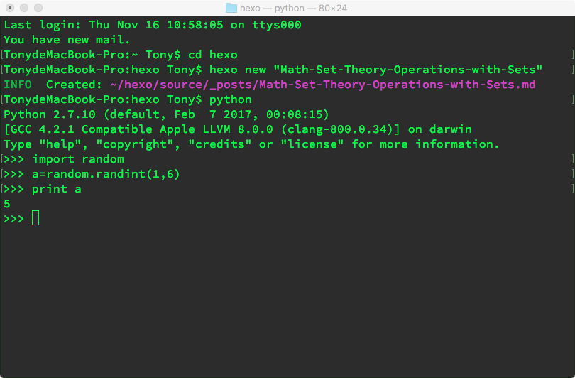
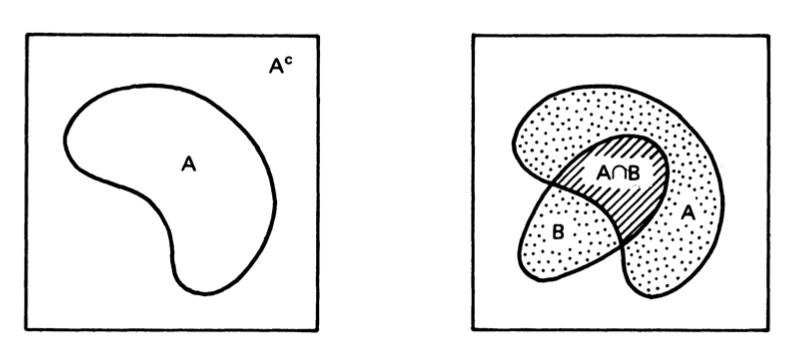
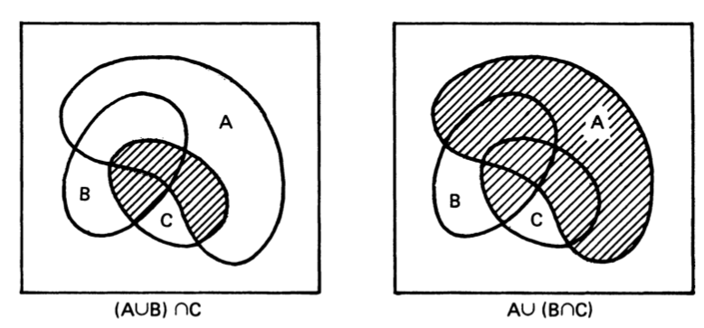
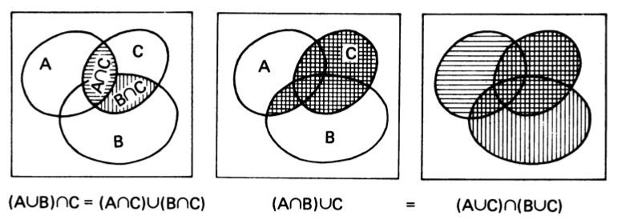
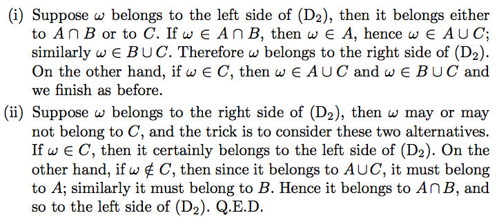

**Abstract:** 本文主要介绍集合论中集合的基本运算和运算法则
**Keywords:** Complement，Union，Intersection，Commutative Law，Associative Law，Distributive laws

<!--more-->
## 开篇废话
这两天写字写的有点多，吐血更新，尤其是线性代数已经接近高潮部分，所以看书时间少了一下，但是感觉看的数量反而没有减少，现在在看概率论的书籍，陈希孺先生的《概率与数理统计》 ，钟开莱先生的《初等概率论》 Morris H.Degroot的他《概率统计》 这三本书后两本是英文，陈希孺先生的是中文，读起来肯定要顺畅一些，但是根据“经验人士透露”这些书都各有长处，所以我决定从一本英文书来下手，陈希孺先生的概率论部分不多，我也先大概多少看了一遍了，接下来是精度了，包括推到里面的所有数学符号，同时在想是看Morris的英文呢？还是看钟开莱先生的英文呢？这两个真的很难选，都是第四版，说明都很畅销，所以我决定扔🎲，如果是小就是钟开莱先生，要是大就Morris，结果跟我想象的差不多，Morris

1到6 ，结果是5
但是集合论这块还是继续用钟开莱先生的书，看完Morris回头再来钟先生
## Operation
我们之前学过很多数字的运算，以及运算法则，下面我们进行扩展，扩展到集合，数字的运算结果是数字，集合的运算结果也是集合，但是要换个名字，比如加法产生和，减法产生差，乘法产生积。

 注意：以下我们要讨论的所有集合的计算都是基于已知固定完整空间 $\Omega$

### Complement
集合 $A$ 的Complement被写成 $A^c$ 表示：
$$
A^c=\{\omega | \omega \notin A\}
$$
$A^c$ 表示在空间 $\Omega$ 中不属于 $A$ 的元素的集合

几个特殊的例子：
1. $\Omega^c=\emptyset$
2. $\emptyset^c=\Omega$
3. $(A^c)^c=A$

### Union
并集，就是把两个集合合并到一起，重复元素只保留一份（避免出现重复出现的情况）

$$A \cup B=\{\omega \in A \, or\, \omega \in B\}$$

逻辑词汇or表示可以前面的也可以后面的也可以两个同时，C语言，C++,离散数学应该都有讲过

### Intersection
交集，元素必须同时出现在两个集合中：
$$A \cap B=\{\omega \in A \, and\, \omega \in B\}$$

逻辑词汇and，必须满足前后两个条件，同时满足哦。

### Commutative Law & Associative Law
$$
A \cup B=B \cup A\\
A \cap B=B \cap A
$$
这个叫交换律
$$
(A \cup B)\cup C= A \cup (B \cup C)\\
(A \cap B)\cap C= A \cap (B \cap C)
$$
这个叫结合律
说了这两个运算律很容让我们联想到加法和乘法，的确是这样，他们确实有些相似之处，
$$
\cup \leftrightarrow +\\
\cap \leftrightarrow \times
$$
所以上面的连续union或者连续intersection各个操作数都可调换位置。
但是
$$
(A \cup B )\cap C \neq  A \cup (B \cap C)
$$
解释可以通过Venn 图来看

Venn图怎么画？画圈就行了，相交的地方是交集，合起来是并集，没圈到的地方是complement，这个我看五年级的小孩都在奥数题里面写这个。

### Distributive Law
这个跟前面就有点不同了
$$
(A \cup B) \cap C=(A \cap C) \cup (B \cap C) \dots\dots (D_1)\\
(A \cap B) \cup C=(A \cup C) \cap (B \cup C) \dots\dots (D_2)
$$
这两个公式都是正确的么？证明一个公式不正确，只需要找到一个反例就可以但是要证明一个公式正确，就很麻烦了。那么我们还是用五年级奥数的方法来检验一下这两个公式哪些是正确的：

通过venn图可以发现，这两个哥们都是正确的，那么我们之前那个类比就有问题了，也就是合集和并集类似加法和乘法在此处不再合理了，并且其实$A \cup A =A$ 就已经宣告类比不成立了。
接着钟老师用了一个食物的例子来证明了一下 $D_1$ 这里就不详细说了，这个比较简单，我们下面用数学的方法来证明下 $D_2$ 证明思想就是(I)证明属于左边的元素都属于右边，(II)再证明右边的元素都属于左边 $M \subset N$ and $M \supset N$
-----

-----
I:假设元素属于左边，那么它属于A交B或者属于C。
①如果属于A交B那么 肯定属于A并C也要属于B并C，所以属于右边
$$
suppos:\\
\omega \in A \cap B\\
then:\\
\omega \in A \cup C\\
\omega \in B \cup C
$$
②如果属于C那么肯定也属于右边了
$$
suppos:\\
\omega \in C\\
then:\\
\omega \in A \cup C\\
\omega \in B \cup C
$$
II假设元素属于右边
①如果元素属于C，那么肯定属于左边
$$
suppos:\\
\omega \in C\\
then:\\
\omega \in (A \cap B) \cup C
$$
②如果元素不属于C，属于A并C同时也属于B并C，那么元素属于A并且属于B，所以元素属于A并B属于左边
$$
suppos:\\
\omega \in A \cup C\\
\omega \in B \cup C\\
\omega \notin C\\
then:\\
\omega \in A \\
\omega \in B \\
\omega \in A \cap B \\
$$
Q.E.D

## Conclusion
今天已经写了两篇博客了，这篇还好比较短，集合作为最基础的数学框架，有很多是从没有文字就开始有了的，过于理论化的东西也不是我们研究的对象，我们要做的就是多画画多理解，好在后面看算法看其他过程的时候心里没有恐惧。
待续。。。
