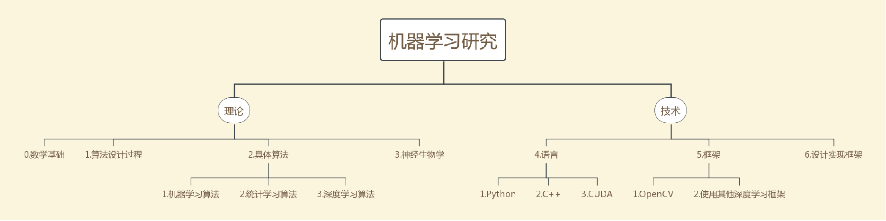

本页面是全站写作思路和超级索引，所有文章都能通过索引跳转到相关文章，当然也可以使用搜索功能查找相关的话题。

<!--more-->

首先插入一下我的整体研究思路，也就是网站大致的更新顺序：

***以下目录点击直接传送：***

>理论：

- 数学基础
  - 集合论
    - [1 样本集](http://tony4ai.com/2017/11/14/Math-Set-Theory-Sample-Sets/)
    - [2 集合操作](http://tony4ai.com/2017/11/16/Math-Set-Theory-Operations-with-Sets/)
  - 分析
    - 微积分
    - 数学分析
      - 《陶哲轩实分析》
        - [1.0 数学分析介绍](http://tony4ai.com/2018/03/09/Math-Analysis-0-0-Introduction/)
    - 实分析
    - 复分析
    - 泛函分析
    - 测度论
  - 线性代数
    - 《Introduction to Linear Algebra》
      - [线性代数BigPicture](http://tony4ai.com/2017/08/18/Math-Linear_Algebra_big_picture/)
      - [1.0 向量](http://tony4ai.com/2017/08/28/Math-Linear-Algebra-Chapter-1-0/)
      - [1.1 线性组合](http://tony4ai.com/2017/08/28/Math-Linear-Algebra-Chapter-1-1/)
      - [1.2 点乘和长度](http://tony4ai.com/2017/08/28/Math-Linear-Algebra-Chapter-1-2/)
      - [2.1 Ax=b](http://tony4ai.com/2017/08/31/Math-Linear-Algebra-Chapter-2-1/)
      - [2.2 消元](http://tony4ai.com/2017/08/31/Math-Linear-Algebra-Chapter-2-2/)
      - [2.3 消元和矩阵](http://tony4ai.com/2017/08/31/Math-Linear-Algebra-Chapter-2-3/)
      - [2.4 矩阵计算](http://tony4ai.com/2017/09/05/Math-Linear-Algebra-Chapter-2-4/)
      - [2.5 逆](http://tony4ai.com/2017/09/11/Math-Linear-Algebra-Chapter-2-5/)
      - [2.6 LU和LDU分解](http://tony4ai.com/2017/09/12/Math-Linear-Algebra-Chapter-2-6/)
      - [2.7 映射与排列](http://tony4ai.com/2017/09/12/Math-Linear-Algebra-Chapter-2-7/)
      - [3.1 向量空间](http://tony4ai.com/2017/09/19/Math-Linear-Algebra-Chapter-3-1/)
      - [3.2 Null 空间](http://tony4ai.com/2017/09/19/Math-Linear-Algebra-Chapter-3-2/)
      - [3.3 秩](http://tony4ai.com/2017/09/25/Math-Linear-Algebra-Chapter-3-3/)
      - [3.4 Ax=B](http://tony4ai.com/2017/09/25/Math-Linear-Algebra-Chapter-3-4/)
      - [3.5 线性独立，基和维度](http://tony4ai.com/2017/09/25/Math-Linear-Algebra-Chapter-3-5/)
      - [3.6 四个空间的维度](http://tony4ai.com/2017/09/25/Math-Linear-Algebra-Chapter-3-6/)
      - [4.1 四个子空间的正交](http://tony4ai.com/2017/10/17/Math-Linear-Algebra-Chapter-4-1/)
      - [4.2 投影](http://tony4ai.com/2017/10/17/Math-Linear-Algebra-Chapter-4-2/)
      - [4.3 最小二乘（略）](http://tony4ai.com/2017/10/17/Math-Linear-Algebra-Chapter-4-3/)
      - [4.4 正交基和Gram-Schmidt算法](http://tony4ai.com/2017/10/19/Math-Linear-Algebra-Chapter-4-4/)
      - [5.1 行列式的性质](http://tony4ai.com/2017/11/02/Math-Linear-Algebra-Chapter-5-1/)
      - [5.2 排列和代数余子式](http://tony4ai.com/2017/11/03/Math-Linear-Algebra-Chapter-5-2/)
      - [5.3 Cramer's 法则,逆和体积](http://tony4ai.com/2017/11/05/Math-Linear-Algebra-Chapter-5-3/)
      - [6.1 特征值介绍](http://tony4ai.com/2017/11/14/Math-Linear-Algebra-Chapter-6-1/)
      - [6.2 矩阵对角化](http://tony4ai.com/2017/11/21/Math-Linear-Algebra-Chapter-6-2/)
      - [6.3 微分方程应用（略）](http://tony4ai.com/2017/11/22/Math-Linear-Algebra-Chapter-6-3/)
      - [6.4 对称矩阵](http://tony4ai.com/2017/11/22/Math-Linear-Algebra-Chapter-6-4/)
      - [6.5 正定矩阵](http://tony4ai.com/2017/11/24/Math-Linear-Algebra-Chapter-6-5/)
      - [6.6 相似矩阵](http://tony4ai.com/2017/11/29/Math-Linear-Algebra-Chapter-6-6/)
      - [6.7 奇异值分解](http://tony4ai.com/2017/11/30/Math-Linear-Algebra-Chapter-6-7/)
      - [7.1 线性变换思想](http://tony4ai.com/2017/12/04/Math-Linear-Algebra-Chapter-7-1/)
      - [7.2 线性变换的矩阵](http://tony4ai.com/2017/12/04/Math-Linear-Algebra-Chapter-7-2/)
      - [7.3 对角化和伪逆](http://tony4ai.com/2017/12/06/Math-Linear-Algebra-Chapter-7-3/)
  - 微分方程
  - 拓扑学
  - 概率论
    - [概率论BigPicture](http://tony4ai.com/2017/11/13/Math-Probability-Big-Picture/)
    - [1.0 概率介绍、试验、事件、公理化的概率](http://tony4ai.com/2018/01/23/Math-Probability-1-0-Introduction/)
    - [1.1 样本空间、柯氏公理、概率的性质](http://tony4ai.com/2018/01/24/Math-Probability-1-1-Definition-of-Probability/)
    - [1.2 古典概率、乘法原理、排列](http://tony4ai.com/2018/01/25/Math-Probability-1-2-Counting-Methods/)
    - [1.3 组合、二项式定理、多项式定理](http://tony4ai.com/2018/01/26/Math-Probability-1-3-Combinatorial-Methods/)
    - [1.4 有限事件并的概率、概率欺骗了你](http://tony4ai.com/2018/01/30/Math-Probability-1-4-Union-of-Event/)
    - [2.1 条件概率、全概率公式](http://tony4ai.com/2018/01/31/Math-Probability-1-5-Conditional-Probability/)
    - [2.2 事件独立、条件独立](http://tony4ai.com/2018/02/01/Math-Probability-2-2-Independent-Events/)
    - [2.3 Bayes’ Theorem](http://tony4ai.com/2018/02/02/Math-Probability-2-3-Bayes-Teorem/)
    - [3.1 Random Variables and Discrete Distributions](http://tony4ai.com/2018/02/03/Math-Probability-3-1-Random-Variables-and-Discrete-Distributions/)
    - [3.2 Continuous Distributions](http://tony4ai.com/2018/02/05/Math-Probability-3-2-Continuous-Distribution/)
    - [3.3 Cumulative Distribution Function](http://tony4ai.com/2018/02/06/Math-Probability-3-3-Cumulative-Distribution-Function/)
    - [3.4 Bivariate Distribution ](http://tony4ai.com/2018/02/07/Math-Probability-3-4-Bivariate-Distribution/)
    - [3.5 Marginal Distribution & Independent random Variables](http://tony4ai.com/2018/02/09/Math-Probability-3-5-Marginal-Distributions/)
    - [3.6 Conditional Distributions (Part I)](http://tony4ai.com/2018/03/08/Math-Probability-3-6-Conditional-Distributions-P1/)
    - [3.6 Conditional Distributions (Part II)](http://tony4ai.com/2018/03/12/Math-Probability-3-6-Conditional-Distributions-P2/)
  - 数理统计
  - 随机过程
  - 信息论
  - 凸优化
- 算法设计过程
- 算法
  - 机器学习算法
  - 统计学习算法
  - 深度学习算法
    - [FaceNet论文阅读](http://tony4ai.com/2017/10/13/Deep-Learning-FaceNet论文阅读/)
    - [可视化CNN](http://tony4ai.com/2017/09/13/Deep-Learning-Visualizing-and-Understanding-CNN/)
    - [LeNet](http://tony4ai.com/2017/09/13/Deep-Learning-LeNet/)
    - [Dropout](http://tony4ai.com/2017/09/13/Deep-Learning-阅读-Dropout-Prevent-NN-from-Overfitting/)
    - [CNN训练数据选择](http://tony4ai.com/2017/09/07/Deep-Learning-CNN训练数据讨论/)
  - 图像处理
    - [1.1 灰度级](http://www.tony4ai.com/2014/11/06/DIP-1-1-不同灰度级的图像/)
    - [1.2 灰度变换，gama变换，对数，反对数变换](http://www.tony4ai.com/2014/11/11/DIP-1-2-灰度变换-gama变换-对数-反对数变换/)
    - [2.1 一维DFT](http://www.tony4ai.com/2014/11/16/DIP-2-1-一维DFT/)
    - [2.2 二维DFT](http://www.tony4ai.com/2014/11/17/DIP-2-2-二维DFT/)
    - [2.3 FFT算法理解与c语言的实现](http://www.tony4ai.com/2014/11/21/DIP-2-3-FFT算法理解与c语言的实现/)
    - [2.4 二维FFT,IFFT,c语言实现](http://www.tony4ai.com/2014/11/25/DIP-2-4-二维FFT-IFFT-c语言实现/)
    - [2.5 图像傅里叶变换（快速傅里叶变换FFT）](http://www.tony4ai.com/2014/12/15/DIP-2-5-图像傅里叶变换-快速傅里叶变换FFT/)
    - [3.0 二值图像](http://www.tony4ai.com/2014/12/24/DIP-3-0-二值图像/)
    - [3.1 二值图像-形态学处理 数学形态学](http://www.tony4ai.com/2014/12/24/DIP-3-1-二值图像-形态学处理1-数学形态学/)
    - [3.2 二值图像-形态学处理 腐蚀和膨胀](http://www.tony4ai.com/2014/12/25/DIP-3-2-二值图像-形态学处理2-腐蚀和膨胀/)
    - [3.3 二值图像-形态学处理 开操作和闭操作](http://www.tony4ai.com/2014/12/26/DIP-3-3-二值图像-形态学处理3-开操作和闭操作/)
    - [3.4 二值图像-形态学处理4 其他操作](http://www.tony4ai.com/2014/12/30/DIP-3-4-二值图像-形态学处理4-其他/)
    - [4.0 灰度图像](http://www.tony4ai.com/2014/12/31/DIP-4-0-灰度图像/)
    - [4.1 灰度图像-形态学处理](http://www.tony4ai.com/2015/01/05/DIP-4-1-灰度图像-形态学处理/)
    - [4.2 灰度图像-频域滤波 傅里叶变换之卷积](http://www.tony4ai.com/2015/01/07/DIP-4-2-灰度图像-频域滤波-傅里叶变换之卷积/)
    - [4.3 灰度图像-频域滤波 傅里叶变换之连续周期信号傅里叶级数](http://www.tony4ai.com/2015/01/09/DIP-4-3-灰度图像-频域滤波-傅里叶变换之连续周期信号傅里叶级数/)
    - [4.4 灰度图像-频域滤波 傅里叶变换之离散周期信号傅里叶级数](http://www.tony4ai.com/2015/01/12/DIP-4-4-灰度图像-频域滤波-傅里叶变换之离散周期信号傅里叶级数/)
    - [4.5 灰度图像-频域滤波 傅里叶变换之连续信号傅里叶变换（FT）](http://www.tony4ai.com/2015/01/13/DIP-4-5-灰度图像-频域滤波-傅里叶变换之连续信号傅里叶变换FT/)
    - [4.6 灰度图像-频域滤波 傅里叶变换之采样定理](http://www.tony4ai.com/2015/01/14/DIP-4-6-灰度图像-频域滤波-傅里叶变换之采样定理/)
    - [4.7 灰度图像-频域滤波 傅里叶变换之离散时间傅里叶变换(DTFT)](http://www.tony4ai.com/2015/01/15/DIP-4-7-灰度图像-频域滤波-傅里叶变换之离散时间傅里叶变换DTFT/)
    - [4.8 灰度图像-频域滤波 傅里叶变换之离散傅里叶变换(DFT)](http://www.tony4ai.com/2015/01/16/DIP-4-8-灰度图像-频域滤波-傅里叶变换之离散傅里叶变换DFT/)
    - [4.9 灰度图像-频域滤波 傅里叶变换之二维离散傅里叶变换](http://www.tony4ai.com/2015/01/18/DIP-4-9-灰度图像-频域滤波-傅里叶变换之二维离散傅里叶变换/)
    - [4.10 灰度图像-频域滤波 概论](http://www.tony4ai.com/2015/01/21/DIP-4-10-灰度图像-频域滤波-概论/)
    - [4.11 灰度图像-频域滤波 滤波器](http://www.tony4ai.com/2015/01/22/DIP-4-11-灰度图像-频域滤波-滤波器/)
    - [4.12 灰度图像-频域滤波 同态滤波](http://www.tony4ai.com/2015/01/23/DIP-4-12-灰度图像-频域滤波-同态滤波/)
    - [5.0 灰度图像-空域滤波 基础：卷积和相关](http://www.tony4ai.com/2015/01/24/DIP-5-0-灰度图像-空域滤波基础-卷积和相关/)
    - [5.1 灰度图像-图像增强 综合介绍](http://www.tony4ai.com/2015/01/27/DIP-5-1-灰度图像-图像增强-综合介绍/)
    - [5.2 灰度图像-图像增强 平滑之均值滤波、高斯滤波](http://www.tony4ai.com/2015/01/28/DIP-5-2-灰度图像-图像增强-平滑之均值滤波-高斯滤波/)
    - [5.3 灰度图像-图像增强 双边滤波 Bilateral Filtering](http://www.tony4ai.com/2015/01/29/DIP-5-3-灰度图像-图像增强-双边滤波BilateralFiltering/)
    - [5.4 灰度图像-图像增强 中值滤波](http://www.tony4ai.com/2015/01/30/DIP-5-4-灰度图像-图像增强-中值滤波/)
    - [5.5 灰度图像-图像增强 锐化基础](http://www.tony4ai.com/2015/01/30/DIP-5-5-灰度图像-图像增强-锐化基础/)
    - [5.6 灰度图像--图像增强 拉普拉斯算子](http://www.tony4ai.com/2015/01/31/DIP-5-6-灰度图像-图像增强-拉普拉斯算子/)
    - [5.7 灰度图像-图像增强 非锐化掩蔽 （Unsharpening Mask）](http://www.tony4ai.com/2015/01/31/DIP-5-7-灰度图像-图像增强-非锐化掩蔽UnsharpeningMask/)
    - [5.8 灰度图像-图像增强 Robert算子、Sobel算子](http://www.tony4ai.com/2015/02/01/DIP-5-8-灰度图像-图像增强-Robert算子-Sobel算子/)
    - [5.9 灰度图像--图像增强 灰度变换](http://www.tony4ai.com/2015/02/03/DIP-5-9-灰度图像-图像增强-灰度变换/)
    - [5.10 灰度图像--图像增强 直方图均衡化（Histogram Equalization)](http://www.tony4ai.com/2015/02/03/DIP-5-10-灰度图像-图像增强-直方图均衡化HistogramEqualization/)
    - [5.11 灰度图像-图像增强 直方图匹配（规定化）Histogram Specification](http://www.tony4ai.com/2015/02/04/DIP-5-11-灰度图像-图像增强-直方图匹配-规定化-HistogramSpecification/)
    - [6.0 灰度图像-图像分割 综合介绍](http://www.tony4ai.com/2015/02/05/DIP-6-0-灰度图像-图像分割-综合介绍/)
    - [6.1 灰度图像-图像分割 边缘模型](http://www.tony4ai.com/2015/02/05/DIP-6-1-灰度图像-图像分割-边缘模型/)
    - [6.2 灰度图像-图像分割 边缘检测算子 综述](http://www.tony4ai.com/2015/02/09/DIP-6-2-灰度图像-图像分割-边缘检测算子-综述/)
    - [6.3 灰度图像-图像分割 Robert算子](http://www.tony4ai.com/2015/02/09/DIP-6-3-灰度图像-图像分割-Robert算子/)
    - [6.4 灰度图像-图像分割 Sobel算子](http://www.tony4ai.com/2015/02/10/DIP-6-4-灰度图像-图像分割-Sobel算子/)
    - [6.5 灰度图像-图像分割 Prewitt算子](http://www.tony4ai.com/2015/02/11/DIP-6-5-灰度图像-图像分割-Prewitt算子/)
    - [6.6 灰度图像-图像分割 Scharr算子](http://www.tony4ai.com/2015/02/11/DIP-6-6-灰度图像-图像分割-Scharr算子/)
    - [6.7 灰度图像-图像分割 Sobel算子，Prewitt算子和Scharr算子平滑能力比较](http://www.tony4ai.com/2015/02/13/DIP-6-7-灰度图像-图像分割-算子平滑能力比较/)
    - [6.8 灰度图像-图像分割 Canny边缘检测](http://www.tony4ai.com/2015/02/13/DIP-6-8-灰度图像-图像分割-Canny边缘检测/)
    - [6.9 灰度图像-图像分割 Marr-Hildreth算子（LoG算子）](http://www.tony4ai.com/2015/02/13/DIP-6-9-灰度图像-图像分割-Marr-Hildreth算子-LoG算子/)
    - [6.10 灰度图像-图像分割 霍夫变换(Hough Transform)--直线](http://www.tony4ai.com/2015/02/16/DIP-6-10-灰度图像-图像分割-霍夫变换HoughTransform-直线/)
    - [7.0 灰度图像-图像分割 阈值处理综述](http://www.tony4ai.com/2015/02/22/DIP-7-0-灰度图像-图像分割-阈值处理综述/)
    - [7.1 灰度图像-图像分割 阈值处理之平均阈值](http://www.tony4ai.com/2015/03/06/DIP-7-1-灰度图像-图像分割-阈值处理之平均阈值/)
    - [7.2 灰度图像-图像分割 阈值处理之P-Tile阈值](http://www.tony4ai.com/2015/03/06/DIP-7-2-灰度图像-图像分割-阈值处理之P-Tile阈值/)
    - [7.3 灰度图像--图像分割 阈值处理之迭代均值阈值](http://www.tony4ai.com/2015/03/07/DIP-7-3-灰度图像-图像分割-阈值处理之迭代均值阈值/)
    - [7.4 灰度图像-图像分割 阈值处理之谷底阈值、峰顶平均](http://www.tony4ai.com/2015/03/07/DIP-7-4-灰度图像-图像分割-阈值处理之谷底阈值-峰顶平均/)
    - [7.5 灰度图像-图像分割 阈值处理之OTSU阈值](http://www.tony4ai.com/2015/03/08/DIP-7-5-灰度图像-图像分割-阈值处理之OTSU阈值/)
    - [7.6 灰度图像--图像分割 阈值处理之补充说明](http://www.tony4ai.com/2015/03/08/DIP-7-6-灰度图像-图像分割-阈值处理之补充说明/)
    - [7.7 灰度图像-图像分割 阈值处理之局部阈值](http://www.tony4ai.com/2015/03/09/DIP-7-7-灰度图像-图像分割-阈值处理之局部阈值/)
    - [7.8 灰度图像-图像分割 区域分割之区域生长](http://www.tony4ai.com/2015/03/10/DIP-7-8-灰度图像-图像分割-区域分割之区域生长/)
    - [7.9 灰度图像-图像分割 区域分割之区域分离](http://www.tony4ai.com/2015/03/10/DIP-7-9-灰度图像-图像分割-区域分割之区域分离/)
    - [7.10 灰度图像-图像分割 区域分割之分水岭算法](http://www.tony4ai.com/2015/03/11/DIP-7-10-灰度图像-图像分割-区域分割之分水岭算法/)
    - [8.0 彩色模型，CIE XYZ，CIE RGB](http://www.tony4ai.com/2015/03/11/DIP-8-0-彩色模型-CIEXYZ-CIERGB/)
    - [8.1 彩色图像-色彩空间 综述](http://www.tony4ai.com/2015/03/11/DIP-8-1-彩色图像-色彩空间-综述/)
    - [8.2 彩色图像-色彩空间 RGB系列](http://www.tony4ai.com/2015/03/12/DIP-8-2-彩色图像-色彩空间-RGB系列/)
    - [8.3 彩色图像-色彩空间 CMY(K)空间](http://www.tony4ai.com/2015/03/12/DIP-8-3-彩色图像-色彩空间-CMY-K空间/)
    - [8.4 彩色图像-色彩空间 YIQ 、YUV 、YCbCr 、YC1C2 和I1I2I3](http://www.tony4ai.com/2015/03/13/DIP-8-4-彩色图像-色彩空间-YIQ-YUVYCbCr-YC1C2和I1I2I3/)
    - [8.5 彩色图像-色彩空间 CIELAB、CIELUV](http://www.tony4ai.com/2015/03/14/DIP-8-5-彩色图像-色彩空间-CIELAB-CIELUV/)
    - [8.6 彩色图像-色彩空间 HSI(HSL)、HSV(HSB)](http://www.tony4ai.com/2015/03/15/DIP-8-6-彩色图像-色彩空间-HSI-HSL-HSV-HSB/)
    - [8.7 彩色图像-色彩空间 总结](http://www.tony4ai.com/2015/03/15/DIP-8-7-彩色图像-色彩空间-总结/)
    - [9.1 彩色图像-伪彩处理 灰度图转伪彩色图像](http://www.tony4ai.com/2015/03/16/DIP-9-1-彩色图像-伪彩处理-灰度图转伪彩色图像/)
    - [9.2 彩色图像-彩色变换 补色处理](http://www.tony4ai.com/2015/03/16/DIP-9-2-彩色图像-彩色变换-补色处理/)
    - [10.1 彩色图像-图像增强 直方图增强](http://www.tony4ai.com/2015/03/17/DIP-10-1-彩色图像-图像增强-直方图增强/)
    - [10.2 彩色图像-图像增强 图像平滑](http://www.tony4ai.com/2015/03/17/DIP-10-2-彩色图像-图像增强-图像平滑/)
    - [10.3 彩色图像-图像增强 图像锐化](http://www.tony4ai.com/2015/03/17/DIP-10-3-彩色图像-图像增强-图像锐化/)
    - [10.4 彩色图像-图像分割 彩色空间分割](http://www.tony4ai.com/2015/03/18/DIP-10-4-彩色图像-图像分割-彩色空间分割/)

  - 遗传算法
- 神经生物学

------------

> 技术

- 语言
  - C++
  - Python
    - Web Crawler
      - [1.0 Introduction](http://tony4ai.com/2018/03/01/Crawler-Introduction/)
      - [2.0 分析目标网站](http://tony4ai.com/2018/03/02/Crawler-分析确定目标/)
      - [3.0 三只虫](http://tony4ai.com/2018/03/03/Crawler-3-0-第一个爬虫/)
      - [3.1 HTTP协议（一）](http://tony4ai.com/2018/03/04/Crawler-3-1-HTTP协议-一/)
      - [3.2 HTTP协议（二）](http://tony4ai.com/2018/03/05/Crawler-3-2-HTTP协议-二/)
      - [3.3 数据抓取](http://tony4ai.com/2018/03/06/Crawler-3-3-数据抓取/)
  - CUDA
    - [0.0 腾讯云CUDA环境搭建](http://tony4ai.com/2018/02/13/CUDA-F-0-0-Tencent-GPU-Cloud/)
    - [1.0 并行计算与计算机架构](http://tony4ai.com/2018/02/14/CUDA-F-1-0-并行计算与计算机架构/)
    - [1.1 异构计算与CUDA](http://tony4ai.com/2018/02/15/CUDA-F-1-1-异构计算-CUDA/)
    - [2.0 CUDA编程模型概述(一)](http://tony4ai.com/2018/02/15/CUDA-F-2-0-CUDA编程模型概述1/)
    - [2.1 CUDA编程模型概述(二)](http://tony4ai.com/2018/02/16/CUDA-F-2-1-CUDA编程模型概述2/)
    - [2.2 给核函数计时](http://tony4ai.com/2018/03/08/CUDA-F-2-2-核函数计时/)
    - [2.3 组织并行线程](http://tony4ai.com/2018/03/09/CUDA-F-2-3-组织并行线程/)
    - [2.4 设备信息查询](http://tony4ai.com/2018/03/10/CUDA-F-2-4-设备信息/)
    - [3.1 CUDA执行模型概述](http://tony4ai.com/2018/03/12/CUDA-F-3-1-CUDA执行模型概述/)
- 框架
  - OpenCV
    - [OpenCV矩阵计算分析](http://tony4ai.com/2017/12/29/Code-OpenCV-Mat过程分析/)
  - TensorFlow .etc
- 设计实现框架
  - PineNut

-------------

> 随笔

- 其他
  - [推荐读物](http://tony4ai.com/2017/09/07/other-Tony推荐读物/)
  - [学习](http://tony4ai.com/2017/09/07/other-Tony说学习/)
  - [Hexo博客搭建](http://tony4ai.com/2017/08/24/other-用atom-markdown-hexo-github写博客/)
